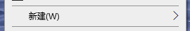
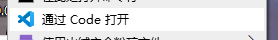
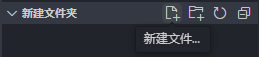
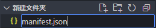
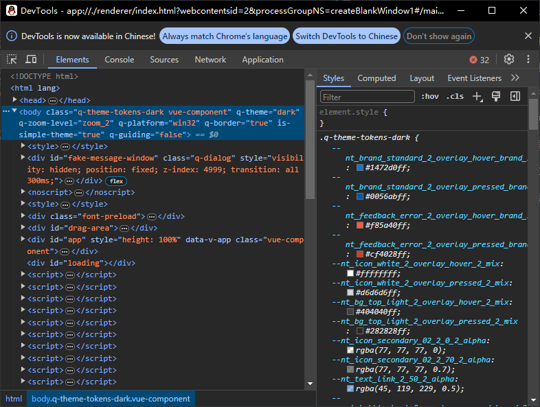
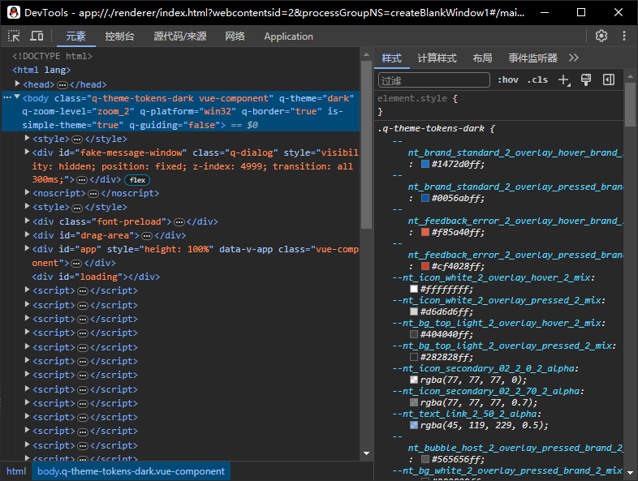

# LiteLoaderQQNT-QuickStart
此[文档](https://github.com/854675824/LiteLoaderQQNT-QuickStart/blob/main/README.md) 适用于 LiteLoaderQQNT 插件开发的初学者，只需要了解基本的 JavaScript 语法就可以快速上手 LiteLoaderQQNT 插件开发。

## 什么是 LiteLoaderQQNT?
[**LiteLoaderQQNT**](https://github.com/LiteLoaderQQNT/LiteLoaderQQNT) 是 **NTQQ** 的插件加载器，一般在 **QQNT** 的环境内简称为 **LiteLoader**。**LiteLoaderQQNT** 可以为 **NTQQ** 添加各种功能。

## 安装 LiteLoaderQQNT
### 准备好以下文件后开始安装
* [DLLHijackMethod](https://github.com/LiteLoaderQQNT/QQNTFileVerifyPatch/releases/latest) 用于过掉 QQNT Patch 文件检测。（64 位系统选择 `dbghelp_x64.dll` 下载，32 位系统选择 `dbghelp_x86.dll` 下载）
* [LiteLoaderQQNT](https://github.com/LiteLoaderQQNT/LiteLoaderQQNT/releases/latest) **LiteLoaderQQNT** 本体，直接选择 **`LiteLoaderQQNT.zip`** 下载即可

### 过掉 QQNT Patch 文件检测
右键任务栏中托盘图标中的 **QQ** 并在弹出的菜单中选择 **退出**，将 **`dbghelp_x64.dll` (如果是 32 位系统则为 `dbghelp_x86.dll`)** 文件重命名为 **`dbghelp.dll`**,右键桌面 **QQ** 快捷方式，选择 "**打开文件所在位置(I)**"，复制 **`dbghelp.dll`** 到与 **`QQ.exe`** 文件同级的目录下

### 找到 QQ 的应用目录
右键桌面 **QQ** 快捷方式，选择 "**打开文件所在位置(I)**" 切换到 QQ 的目录，查看当前目录是否存在 **`versions`** 目录。若存在 **`versions`** 目录，则打开 **`versions`** => **`版本号`** => **`resources`** => **`app`** 目录；若不存在 **`versions`** 目录，则打开当前目录的 **`resources`** => **`app`** 目录。这个 **`app`** 目录就是 QQ 的应用目录。

### 解压 LiteLoaderQQNT 本体
将 **`LiteLoaderQQNT.zip`** 解压到任意目录下，推荐存放在系统 **文档** 目录下。（这里以系统 **文档** 目录为例）

### 注入 LiteLoaderQQNT 插件加载器
在 **`app`** 目录下找到 **`app_launcher`** 目录并进入，创建 **`liteloader.js`** 文件，并写入以下代码：（其中 **C:\Users\Cheese\Documents\LiteLoaderQQNT** 为你的 LiteLoaderQQNT 的安装目录）
```js
require(String.raw`C:\Users\Cheese\Documents\LiteLoaderQQNT`)
```

### 修改 QQ 的启动文件
在 **`app`** 目录下找到 **`package.json`** 文件并编辑，找到 **"main":** 那行并修改为以下代码：
```js
"main": "./app_launcher/liteloader.js",
```

### 判断 LiteLoaderQQNT 是否安装成功
双击桌面上的 **QQ** 图标，单击登录按钮，在主界面出现之后，单击左下角的 "**菜单**" 按钮，选择 "**设置**" ，查看设置列表是否出现 "**`LiteLoaderQQNT`**" 选项。若出现则表示安装成功。

## 编写你的第一个 LiteLoaderQQNT 插件
### 环境准备
* [Visual Studio Code](https://code.visualstudio.com/) 开源的轻量级代码编辑器。

### 创建项目
右击桌面空白处，选择 "**新建(W)**"，选择 "**文件夹(F)**"，输入项目名称后回车。
  

### 使用 Visual Studio Code 打开项目
右击项目文件夹，选择 "**通过 Code 打开**"。  


### 创建 manifest.json 配置文件
在项目文件夹中创建一个名为 **`manifest.json`** 的文件，并写入以下代码：
  

```json5
{
    // 必选，当前版本为 4
    "manifest_version": 4,
    // 可选，插件类型，可写 extension | theme | framework
    "type": "extension",
    // 必选，插件名字
    "name": "插件模板",
    // 必选，代码内标识
    "slug": "plugin_template",
    // 必选，插件描述
    "description": "LiteLoaderQQNT的插件模板",
    // 必选，版本号
    "version": "0.1.0",
    // 可选，插件的图标，写入相对路径字符串，也可以是 null
    "icon": null,
    // 可选，设置选项的图标，写入相对路径字符串，也可以是 null
    "thumb": null,
    // 必选，作者们的信息
    "authors": [
        {
            "name": "LiteLoaderQQNT",                       // 必选，作者名字
            "link": "https://github.com/LiteLoaderQQNT"     // 必选，作者链接
        }
    ],
    // 可选，插件依赖项，写入插件slug名
    "dependencies": [
        "slug"
    ],
    // 必选，插件支持的系统平台，Windows: win32 | Linux: linux | MacOS: darwin
    "platform": [
        "win32",
        "linux",
        "darwin"
    ],
    // 可选，要注入的脚本
    "injects": {
        "renderer": "./src/renderer.js",    // 可选，渲染进程
        "main": "./src/main.js",            // 可选，主进程
        "preload": "./src/preload.js"       // 可选，预加载脚本
    },
    // 可选，插件仓库信息
    "repository": {
        // 必选，仓库短地址
        "repo": "LiteLoaderQQNT/Plugin-Template",
        // 必选，分支名称
        "branch": "main",
        // 可选，不写将使用仓库源码
        "release": {
            // 必选，tag 名称，不推荐写 latest
            "tag": "0.1.0",
            // 可选，release 内的文件名，不填会直接下载 tag 的源码
            "file": "Plugin-Template.zip"
        }
    }
}
```
### 各参数作用
| 参数 | 作用 |
| --- | --- |
| manifest_version | 插件的版本，目前只支持 4 |
| type | 插件类型，可写 `extension` (插件)、`theme` (主题) 和 `framework` (框架)|
| name | 插件名字 |
| slug | 插件代码内标识 (可以理解为插件的包名) |
| description | 插件描述 |
| version | 版本号 |
| icon | 插件的图标，写入相对路径字符串，也可以是 `null` |
| thumb | 设置选项的图标，写入相对路径字符串，也可以是 `null` |
| authors | 作者们的信息 |
| authors.name | 作者的名字 |
| authors.link | 作者的链接 |
| dependencies | 插件依赖项，写入插件的 slug 名 |
| platform | 插件支持的系统平台，`Windows: win32`、`Linux: linux`、`MacOS: darwin` |
| injects | 要注入的脚本 |
| injects.renderer | 渲染进程 |
| injects.main | 主进程 |
| injects.preload | 预加载脚本 |
| repository | 插件仓库信息 |
| repository.repo | 仓库短地址(例: https://github.com/LiteLoaderQQNT/Plugin-Template => `LiteLoaderQQNT/Plugin-Template`) |
| repository.branch | 分支名称 |
| repository.release | release 内的文件名，不填会直接下载 tag 的源码 |
| repository.release.tag | tag 名称，不推荐写 latest |
| repository.release.file | release 内的文件名，不填会直接下载 tag 的源码 |

### 删除 JSON 中的所有注释（补充）
在 VS Code 中按下 *Ctrl+H*，在 **查找** 输入框中输入 `.*\/\/.+\n? ` 并勾选 **正则表达式**，**替换** 输入框为空。

## LiteLoaderQQNT 插件接口
**LiteLoader** 插件加载顺序如下:
1. **`main.js`** 主进程
2. **`preload.js`** 预加载脚本
3. **`renderer.js`** 渲染进程

### 主进程接口 main.js
| 接口名称 | 接口参数 | 接口说明 |
| --- | --- | --- |
| `onBrowserWindowCreated` | `(window)` | 浏览器窗口创建后执行 |
| `onLogin` | `(uid)` | 登录后执行 |

### 预加载脚本接口 preload.js
无

### 渲染进程接口 renderer.js
| 接口名称 | 接口参数 | 接口说明 |
| --- | --- | --- |
| `onSettingWindowCreated` | `settingInterface` | 监听插件设置窗口创建事件，调用插件的 `onSettingWindowCreated` 方法。 |
| `onVueComponentMount` | `component` | 监听 Vue 组件挂载事件，调用插件的 `onVueComponentMount` 方法。 |
| `onVueComponentUnmount` | `component` | 监听 Vue 组件卸载事件，调用插件的 `onVueComponentUnmount` 方法。 |

### 插件代码例子
#### 在用户打开 QQ 窗口创建后触发对话框
main.js
```js
// 监听窗口创建事件
function onBrowserWindowCreated(){
    alert("欢迎使用 Example 插件!");
}
```
#### 在用户登陆 QQ 后触发对话框
main.js
```js
// 监听登录事件
function onLogin(uid){
    alert("用户: "+ uid + "\n欢迎使用 Example 插件!");
}
```
#### 判断是否为聊天界面
main.js
```js
module.exports.onBrowserWindowCreated = window => {
    window.webContents.on("did-stop-loading", async () => {
        const id = window.id;
        const url = window.webContents.getURL();
        if (window.webContents.getURL().includes("#/main/message") || window.webContents.getURL().includes("#/chat")){
            // 当前是聊天窗口
            alert("当前窗口 ID 为 " + id + "\n当前窗口 URL 为 " + url + "\n当前窗口标题为 " + window.getTitle() + "\n当前窗口为聊天界面" + "\n当前窗口大小为 " + window.getSize() + "\n当前窗口位置为 " + window.getPosition())
        }else{
            // 当前不是聊天窗口
            alert("当前窗口 ID 为 " + id + "\n当前窗口 URL 为 " + url + "\n当前窗口标题为 " + window.getTitle() + "\n当前窗口不为聊天界面" + "\n当前窗口大小为 " + window.getSize() + "\n当前窗口位置为 " + window.getPosition())
        }
    })
}

```
#### 设置面板示例
content.html
```html
<meta charset="UTF-8">
<!-- 最外层的内容控件 -->
<!-- 推荐使用 LiteLoader 官方的 Web Components 组件 -->
<!-- https://liteloaderqqnt.github.io/docs/web-components.html -->
<div class="content-view content_view">
    <p>Hello, World!</p>
</div>
```
main.js
```js
// 导入 Electron 模块
const {ipcMain} = require("electron");
// 导入文件模块
const fs = require("fs");
// 读取设置界面内容
ipcMain.handle("LiteLoader.example11.getSettingContent", () => fs.readFileSync(path.join(
    LiteLoader.plugins.example11.path.plugin, 'content.html'), 'utf-8'))

```
preload.js
```js
// Electron 主进程与渲染进程 交互的桥梁
const { contextBridge, ipcRenderer } = require("electron");
contextBridge.exposeInMainWorld("example11", {
    // 定义获取设置内容的方法
    getSettingContent: () => ipcRenderer.invoke("LiteLoader.example11.getSettingContent"),
});
```
renderer.js
```js
// 监听设置窗口创建事件
export const onSettingWindowCreated = async view => {
    try {
        // 创建 DOM 解析器
        const parser = new DOMParser()
        // 解析 HTML 界面
        const content = parser.parseFromString(await window.example11.getSettingContent(), "text/html").querySelector(".content-view")
        // 添加到设置界面
        view.appendChild(content);
    } catch (e) {
        // 弹出错误信息
        alert(e)
    }
}
```


## LiteLoaderQQNT 加载流程
**LiteLoader** 的加载流程如下:
1. QQ NT 启动
2. 加载 **LiteLoader** 的 **`init.js`**
3. 加载 **LiteLoaderAPI** 接口 (定义 LiteLoader 接口)
4. 加载 **Loader Core** 的插件加载器 (载入所有插件)
5. 加载 **LiteLoader** 的 **`main.js`**
6. 加载 **MainLoader**，加载所有插件的 **`main.js`** 文件  
   **`main.js`** 有 **onBrowserWindowCreated** 和 **onLogin** 两个函数，  
   分别在浏览器窗口创建后和登录后执行。
7. 加载 **Protocol Scheme** 注册 **local://** 自定义协议
8. 加载 **Preload** 用于注入页面的预加载脚本
9. 加载 **Preload LiteLoader API** 向页面注入 LiteLoader 的 API
10. 加载 **Preload Loader Core** 用于加载所有插件的 **`preload.js`** 文件
11. 加载 **Renderer** 注入页面渲染
12. 加载 **SettingInterface** 提供关于设置界面接口
13. 加载 **Web Component** 为开发者提供组件接口
14. 加载 **Loader Core RendererLoader** 用于加载所有插件的 **`renderer.js`** 文件
15. 加载 QQ NT 主界面


安装 **LiteLoaderQQNT** 时修改了 **QQ** 的配置文件 **`package.json`** 的 **main** 字段，当 **QQ** 被加载的时候，实际上加载的是当前目录 **app_launcher** 中的 **`liteloader.js`** 文件，而 **`liteloader.js`** 的内容是 ``require(String raw `C:\Users\Cheese\Documents\LiteLoaderQQNT\`)``，这里需要了解 **require** 函数和 **String.raw** 函数。

### require 函数
require 函数用于加载模块，其参数为模块的绝对路径，这个路径可以为文件或者是文件夹。当加载文件夹时，require 就会读取文件夹下的 **`package.json`** 中的 **main** 字段，然后加载 **main** 字段指向的 JS 文件；若不存在 **main** 字段，或者是根本不存在 **`package.json`** 文件，则默认查找该文件夹下的 **`index.js`** 文件作为模块来载入。）
### String.raw 函数
**String.raw** 函数用于返回一个字符串，该字符串使用原始的字符串字面量，即不会解析转义字符。
```js
// 创建名为 str 的变量，他的值为 String.raw`\n`，其中 `` 为 模板字符串，\n 为转义字符
let str = String.raw`\n`;
// 输出 str 的值，此时输出的不是换行而是 \n
console.log(str); // \n
// 判断 str 的值是否为 \n，此时输出 true
console.log(str === '\\n'); // true
// 判断 str 的值是否为换行符，此时输出 false
console.log(str === '\n'); // false
```
---
了解了 **require** 函数和 **String.raw** 函数，那么 **`liteloader.js`** 的作用就是加载 **`LiteLoaderQQNT`** 文件夹，而 **`LiteLoaderQQNT`** 文件夹下的 **`package.json`** 内容如下：
```json
{
    "name": "liteloader-qqnt",
    "version": "1.2.2",
    "description": "QQNT 插件加载器 LiteLoaderQQNT —— 轻量 · 简洁 · 开源 · 福瑞",
    "main": "./src/init.js",
    "private": true,
    "license": "MIT",
    "author": {
        "name": "LiteLoaderQQNT",
        "url": "https://github.com/LiteLoaderQQNT"
    },
    "homepage": "https://liteloaderqqnt.github.io",
    "bugs": "https://github.com/LiteLoaderQQNT/LiteLoaderQQNT/issues",
    "repository": {
        "type": "git",
        "url": "https://github.com/LiteLoaderQQNT/LiteLoaderQQNT.git"
    }
}
```
可以看到里面的 **`main`** 字段指向了 **`./src/init.js`** 文件，也就是当前 **`package.json`** 所在文件夹中 **`src`** 文件夹里的 **`init.js`** 文件
```js
// 加载 LiteLoaderQQNT 的 API 模块
require("./liteloader_api/main.js");
// 加载插件加载器
require("./loader_core/plugin_loader.js");
// 加载 LiteLoaderQQNT 的入口文件
require("./main.js");
// 调用 path 模块中的 join 方法拼接路径，等效于 require(process.resourcesPath + "/app/app_launcher/index.js")
require(require("path").join(process.resourcesPath, "app/app_launcher/index.js"));

// 延迟 0 ms 后还原 QQ 的 package.json 中的 main 字段指向的文件
setTimeout(() => {
    // 判断当前 QQNT 的构建版本号是否大于等于 28060
    if (LiteLoader.package.qqnt.buildVersion >= 28060) {
        // 设置 QQ 的 main 字段指向的入口文件
        global.launcher.installPathPkgJson.main = "./application/app_launcher/index.js";
    } else {
        // 设置 QQ 的 main 字段指向的入口文件
        global.launcher.installPathPkgJson.main = "./app_launcher/index.js";
    }
}, 0);
```
### LiteLoaderQQNT API
**LiteLoaderQQNT** 的 **API** 模块位于 **`./liteloader_api`** 文件夹，该文件夹下有 **`main.js`** 和 **`index.js`** 两个文件， **`main.js`** 文件是 LiteLoaderQQNT 的核心模块， **`index.js`** 文件是 **LiteLoaderQQNT** 的入口文件， **`main.js`** 文件的内容如下：
```js
// 获取默认的配置文件
// config.json 文件如下
// {
//     "enable_plugins": true, // 是否启用所有插件
//     "disabled_plugins": [], // 禁用的插件列表
//     "deleting_plugins": {}, // 下次启动时要删除的插件列表
//     "installing_plugins": {} // 下次启动时要安装的插件列表
// }
// 获取默认的配置文件
const default_config = require("../settings/static/config.json");
// 从 Node 环境中加载 electron 的 ipcMain 和 shell 模块
// ipcMain: 处理从渲染器进程（网页）发送的异步和同步消息
// shell: 提供了与系统原生应用程序交互的功能，比如打开外部链接、文件等。
const { ipcMain, shell } = require("electron");
// 加载 nodejs 的 path 和 fs 模块
// path: 用于处理文件路径，如拼接路径等
// 例如: path.dirname(path) 获取指定路径所在的文件夹名称
const path = require("node:path");
// fs: 提供了文件系统操作的 API，如读写文件、创建目录等。
// 例如: fs.readFileSync(path) 读取指定路径的文件内容
const fs = require("node:fs");

// 加载 admZip 模块，用于压缩和解压缩文件
const admZip = (() => {
    // .node文件是Node.js中的一个模块，可以包含JavaScript代码、JSON或者编译过的C/C++扩展。
    // 指定 major 模块路径(内部)
    const major_node = path.join(process.resourcesPath, "app/major.node");
    // 指定 launcher 模块路径(外部)
    const launcher_node = path.join(process.resourcesPath, "app/app_launcher/launcher.node");
    // 调用 fs 模块的 existsSync 函数判断 major.node 是否存在
    if (fs.existsSync(major_node)) {
        // 如果存在，则加载 major.node
        require(major_node).load("internal_admzip", module);
    }
    else {
        // 如果不存在，则加载 launcher.node
        require(launcher_node).load("external_admzip", module);
    }
    // 返回加载的 exports.admZip.default 给外部的 admZip
    return exports.admZip.default;
})();

// 获取 LiteLoaderQQNT 的根目录
const root_path = path.join(__dirname, "..", "..");
// 获取 LiteLoaderQQNT 的配置文件
const profile_path = process.env.LITELOADERQQNT_PROFILE ?? root_path;
// 获取 LiteLoaderQQNT 的数据目录
const data_path = path.join(profile_path, "data");
// 获取 LiteLoaderQQNT 的插件目录
const plugins_path = path.join(profile_path, "plugins");
// 获取 LiteLoaderQQNT 的 package.json 文件
const liteloader_package = require(path.join(root_path, "package.json"));
// 获取 QQNT 的 package.json 文件
const qqnt_package = require(path.join(process.resourcesPath, "app/package.json"))
// 获取 QQNT 的版本信息
const qqnt_version = (() => {
    const config_filepath = path.join(process.resourcesPath, "app/versions/config.json");
    return fs.existsSync(config_filepath) ? require(config_filepath) : qqnt_package;
})();


// 通过插件的 slug 名称写入配置文件
// 成功则返回 true，失败则返回 false
function setConfig(slug, new_config) {
    try {
        // 获取插件的 config.json 配置文件路径
        const config_path = path.join(data_path, slug, "config.json");
        // 创建 config.json 的父文件夹
        fs.mkdirSync(path.dirname(config_path), { recursive: true });
        // 以 UTF-8 的编码格式写入 config.json 配置文件
        // JSON.stringify() 方法用于将 JSON 对象转换为 JSON 字符串
        fs.writeFileSync(config_path, JSON.stringify(new_config, null, 4), "utf-8");
        return true;
    } catch {
        return false;
    }
}

// 通过插件的 slug 名称读取配置文件
// 返回读取到的 JSON 对象
function getConfig(slug, default_config) {
    try {
        // 获取插件的 config.json 配置文件路径
        const config_path = path.join(data_path, slug, "config.json");
        // 判断配置文件是否存在
        if (fs.existsSync(config_path)) {
            // 以 UTF-8 的编码格式读取配置文件
            const config = JSON.parse(fs.readFileSync(config_path, "utf-8"));
            // 合并默认配置和读取到的配置
            return Object.assign({}, default_config, config);
        }
        else {
            // 若不存在则以默认配置创建配置文件
            setConfig(slug, default_config);
            return Object.assign({}, default_config, {});
        }
    } catch {
        // 返回默认配置
        return default_config;
    }
}


// 安装插件
// 第一个参数可以为压缩包路径也可以为解压的插件中的 manifest.json 文件
// 若第二个参数为 true 时则撤销安装插件
function pluginInstall(plugin_path, undone = false) {
    try {
        // 判断指定的路径是否为文件(不存在也为 false)
        if (fs.statSync(plugin_path).isFile()) {
            // 判断文件的扩展名是否为 .zip 格式
            if (path.extname(plugin_path).toLowerCase() == ".zip") {
                // 创建 admZip 对象
                const plugin_zip = new admZip(plugin_path);
                // 遍历压缩包中的所有条目
                for (const entry of plugin_zip.getEntries()) {
                    // 判断文件名是否为 manifest.json 且不是文件夹
                    if (entry.entryName == "manifest.json" && !entry.isDirectory) {
                        // 读取 manifest.json 的 slug 名称
                        // entry.getData() 用于读取条目的数据
                        // JSON.parse() 方法用于将 JSON 字符串转换为 JSON 对象
                        // const { slug } = 可以直接获取 JSON 对象中的属性
                        const { slug } = JSON.parse(entry.getData());
                        // 判断插件是否已安装,若已安装则删除
                        if (slug in LiteLoader.plugins) LiteLoader.api.plugin.delete(slug, false, false);
                        // 获取 LiteLoader 的配置
                        const config = LiteLoader.api.config.get("LiteLoader", default_config);
                        // 如果 undone 为 true 则撤销安装
                        if (undone) delete config.installing_plugins[slug];
                        // 否则添加到正在安装的插件列表
                        else config.installing_plugins[slug] = {
                            // 插件文件路径
                            plugin_path: plugin_path,
                            // 插件文件类型
                            plugin_type: "zip"
                        };
                        // 更新 LiteLoader 的配置
                        LiteLoader.api.config.set("LiteLoader", config);
                        return true;
                    }
                }
            }
            // 通过 manifest.json 文件安装插件
            if (path.basename(plugin_path) == "manifest.json") {
                // 获取插件的 slug 名称
                const { slug } = JSON.parse(fs.readFileSync(plugin_path));
                // 判断插件是否已安装,若已安装则删除
                if (slug in LiteLoader.plugins) LiteLoader.api.plugin.delete(slug, false, false);
                // 获取 LiteLoader 的配置
                const config = LiteLoader.api.config.get("LiteLoader", default_config);
                // 如果 undone 为 true 则撤销安装
                if (undone) delete config.installing_plugins[slug];
                // 否则添加到正在安装的插件列表
                else config.installing_plugins[slug] = {
                    // 插件文件路径
                    plugin_path: plugin_path,
                    // 插件文件类型
                    plugin_type: "json"
                };
                // 更新 LiteLoader 的配置
                LiteLoader.api.config.set("LiteLoader", config);
                return true;
            }
        }
    } catch (error) {
        // 从调试台输出错误信息
        console.error(error);
    }
    return false;
}

// 根据 slug 删除插件
// 第一个参数为插件的 slug
// 第二个参数为是否删除插件的数据文件夹
// 第三个参数为是否撤销删除
function pluginDelete(slug, delete_data = false, undone = false) {
    // 判断插件是否存在，若不存在则直接返回 true 结束函数
    if (!(slug in LiteLoader.plugins)) return true;
    // 获取插件文件夹和数据文件夹路径
    // LiteLoader.plugins[slug].path 为一个 JSON 对象
    const { plugin, data } = LiteLoader.plugins[slug].path;
    // 获取 LiteLoader 的配置
    const config = LiteLoader.api.config.get("LiteLoader", default_config);
    // 如果 undone 为 true 则撤销删除
    if (undone) delete config.deleting_plugins[slug];
    // 否则添加到将删除的插件列表
    else config.deleting_plugins[slug] = {
        // 插件文件路径
        plugin_path: plugin,
        // 插件数据文件夹路径
        data_path: delete_data ? data : null
    };
    // 更新 LiteLoader 的配置
    LiteLoader.api.config.set("LiteLoader", config);
}

// 启用/禁用插件
// 第一个参数为插件的 slug 名称
// 第二个参数为是否撤销禁用 
function pluginDisable(slug, undone = false) {
    // 获取 LiteLoader 的配置
    const config = LiteLoader.api.config.get("LiteLoader", default_config);
    // 如果 undone 为 true 则撤销禁用
    if (undone) config.disabled_plugins = config.disabled_plugins.filter(item => item != slug);
    // 否则添加到禁用的插件列表
    else config.disabled_plugins = config.disabled_plugins.concat(slug);
    // 更新 LiteLoader 的配置
    LiteLoader.api.config.set("LiteLoader", config);
}

// 定义 LiteLoader API
const LiteLoader = {
    path: {
        // LiteLoader 的根目录
        root: root_path,
        // LiteLoader 的配置文件路径
        profile: profile_path,
        // LiteLoader 的数据文件夹路径
        data: data_path,
        // LiteLoader 的插件文件夹路径
        plugins: plugins_path
    },
    versions: {
        // QQNT 的版本信息
        qqnt: qqnt_version.curVersion ?? qqnt_version.version,
        // LiteLoader 的版本信息
        liteloader: liteloader_package.version,
        // Node.js 的版本信息
        node: process.versions.node,
        // Chromium 的版本信息
        chrome: process.versions.chrome,
        // Electron 的版本信息
        electron: process.versions.electron
    },
    os: {
        // 操作系统平台
        platform: process.platform
    },
    package: {
        // LiteLoader 的包信息
        liteloader: liteloader_package,
        // QQNT 的包信息
        qqnt: qqnt_package
    },
    // 插件列表
    plugins: {},
    api: {
        config: {
            // 设置配置
            set: setConfig,
            // 获取配置
            get: getConfig
        },
        plugin: {
            // 安装插件
            install: pluginInstall,
            // 删除插件
            delete: pluginDelete,
            // 启用/禁用插件
            disable: pluginDisable
        },
        // 打开外部链接
        openExternal: shell.openExternal,
        // 打开文件路径
        openPath: shell.openPath
    }
};


// 将 LiteLoader 对象挂载到全局
const whitelist = [
    // LiteLoader 的根目录
    LiteLoader.path.root,
    // LiteLoader 的配置文件路径
    LiteLoader.path.profile,
    // LiteLoader 的数据文件夹路径
    LiteLoader.path.data,
    // LiteLoader 的插件文件夹路径
    LiteLoader.path.plugins,
];
try {
    whitelist.push(fs.realpathSync(LiteLoader.path.root));
    whitelist.push(fs.realpathSync(LiteLoader.path.profile));
    whitelist.push(fs.realpathSync(LiteLoader.path.plugins));
    whitelist.push(fs.realpathSync(LiteLoader.path.data));
} catch { };
// 将 LiteLoader 对象挂载到全局
Object.defineProperty(globalThis, "LiteLoader", {
    // 不可修改
    configurable: false,
    // 不可枚举
    get() {
        const stack = new Error().stack.split("\n")[2];
        if (whitelist.some(item => stack.includes(item))) {
            return LiteLoader;
        }
    }
});


// 将 LiteLoader 对象挂载到 window
ipcMain.on("LiteLoader.LiteLoader.LiteLoader", (event) => {
    // 阻止事件继续传播
    event.returnValue = {
        ...LiteLoader,
        api: void null
    }
});

// 监听 LiteLoader.api
ipcMain.handle("LiteLoader.LiteLoader.api", (event, name, method, args) => {
    try {
        if (name == method) return LiteLoader.api[method](...args);
        else return LiteLoader.api[name][method](...args);
    } catch (error) {
        return null;
    }
});

```

### Loader Core
**`Loader Core`** 是一个核心模块，负责加载插件、启用插件、禁用插件等核心功能。
位于 **`./loader_core/`** 文件夹中，在 LiteLoader 的加载流程中，他是在 **LiteLoader API** 之后被加载的，加载的文件为 **`loader_core.js`**。
```js
// 引入 Electron 的 app 和 dialog 模块
// app 模块用于获取 Electron 的基本信息
// 例如: app.quit() 退出 Electron
// dialog 模块用于弹出对话框
// 例如: dialog.showOpenDialog({ properties: ['openFile', 'multiSelections'] }) 弹出对话框
const { app, dialog } = require("electron");
// 加载 nodejs 的 path 和 fs 模块
// path: 用于处理文件路径，如拼接路径等
// 例如: path.dirname(path) 获取指定路径所在的文件夹名称
const path = require("node:path");
// fs: 提供了文件系统操作的 API，如读写文件、创建目录等。
// 例如: fs.readFileSync(path) 读取指定路径的文件内容
const fs = require("node:fs");
// config.json 文件如下
// {
//     "enable_plugins": true, // 是否启用所有插件
//     "disabled_plugins": [], // 禁用的插件列表
//     "deleting_plugins": {}, // 下次启动时要删除的插件列表
//     "installing_plugins": {} // 下次启动时要安装的插件列表
// }
// 获取默认的配置文件
const default_config = require("../settings/static/config.json");

// 加载 admZip 模块，用于压缩和解压缩文件
const admZip = (() => {
    // .node文件是Node.js中的一个模块，可以包含JavaScript代码、JSON或者编译过的C/C++扩展。
    // 指定 major 模块路径(内部)
    const major_node = path.join(process.resourcesPath, "app/major.node");
    // 指定 launcher 模块路径(外部)
    const launcher_node = path.join(process.resourcesPath, "app/app_launcher/launcher.node");
    // 调用 fs 模块的 existsSync 函数判断 major.node 是否存在
    if (fs.existsSync(major_node)) {
        // 如果存在，则加载 major.node
        require(major_node).load("internal_admzip", module);
    }
    else {
        // 如果不存在，则加载 launcher.node
        require(launcher_node).load("external_admzip", module);
    }
    // 返回加载的 exports.admZip.default 给外部的 admZip
    return exports.admZip.default;
})();

// 定义 output 函数，用于输出日志，会在前面加上绿色的 [LiteLoader] 字样
const output = (...args) => console.log("\x1b[32m%s\x1b[0m", "[LiteLoader]", ...args);
// 获取 LiteLoader 的默认配置
const config = LiteLoader.api.config.get("LiteLoader", default_config);


// 通过 slug 删除插件
function deletePlugin(slug) {
    try {
        // 获取插件的删除路径和数据路径
        const { plugin_path, data_path } = config.deleting_plugins[slug];
        // 递归删除插件的数据文件，recursive: true 表示启用递归删除
        if (data_path) fs.rmSync(data_path, { recursive: true });
        // 递归删除插件的根目录，recursive: true 表示启用递归删除
        fs.rmSync(plugin_path, { recursive: true });
    }
    catch (error) {
        // 输出错误信息
        output("Deleting Plugin Error", error);
        // 在程序准备创建窗口时弹出错误对话框
        app.on("ready", () => {
            // 弹出错误对话框
            dialog.showMessageBox(null, {
                // 设置对话框的类型
                type: "error",
                // 设置对话框的标题
                title: "LiteLoaderQQNT",
                // 设置对话框的内容
                message: `删除插件时报错，请检查并手动删除\n${error}`
            });
        });
    }
    finally {
        // 最后删除 slug
        delete config.deleting_plugins[slug];
        // 更新 LiteLoader 的配置
        LiteLoader.api.config.set("LiteLoader", config);
    }
}


// 通过 slug 安装插件
function InstallPlugin(slug) {
    try {
        // 获取插件的文件路径和文化部类型
        const { plugin_path, plugin_type } = config.installing_plugins[slug];
        // 获取插件在 LiteLoader 存储的文件夹
        const dest_path = path.join(LiteLoader.path.plugins, slug);
        // 判断插件是否已存在，如果存在，则重命名
        if (fs.existsSync(dest_path)) {
            fs.renameSync(dest_path, `${dest_path}_${parseInt(Math.random() * 100000)} `);
        }
        // 判断插件文件是否为 ZIP 文件
        if (plugin_type == "zip") {
            // 解压　ZIP 文件到插件文件夹
            new admZip(plugin_path).extractAllTo(dest_path);
        }
        // 判断插件文件是否为 JSON 文件
        if (plugin_type == "json") {
            // 复制插件所在的文件夹到插件文件夹
            fs.cpSync(path.dirname(plugin_path), dest_path, { recursive: true });
        }
    }
    catch (error) {
        // 输出错误信息
        output("Installing Plugin Error", error);
        // 在程序准备创建窗口时弹出错误对话框
        app.on("ready", () => {
            // 弹出错误对话框
            dialog.showMessageBox(null, {
                // 设置对话框的类型
                type: "error",
                // 设置对话框的标题
                title: "LiteLoaderQQNT",
                // 设置对话框的内容
                message: `安装插件时报错，请检查并手动安装\n${error}`
            });
        });
    }
    finally {
        // 最后删除 slug
        delete config.installing_plugins[slug];
        // 更新 LiteLoader 的配置
        LiteLoader.api.config.set("LiteLoader", config);
    }
}

// 查找所有插件
function findAllPlugin() {
    // 定义 plugins 为插件列表
    const plugins = [];
    try {
        // 创建 LiteLoader 的插件文件夹
        fs.mkdirSync(LiteLoader.path.plugins, { recursive: true });
        // 遍历插件文件夹
        for (const pathname of fs.readdirSync(LiteLoader.path.plugins, "utf-8")) {
            try {
                // 获取插件的 manifest.json 文件
                const filepath = path.join(LiteLoader.path.plugins, pathname, "manifest.json");
                // 读取 manifest.json 文件
                const manifest = JSON.parse(fs.readFileSync(filepath, "utf-8"));
                // 判断 manifest_version 插件版本是否为 4 则插入到 plugins 列表
                if (manifest.manifest_version == 4) plugins.push({ pathname, manifest });
            }
            catch { continue }
        }
    }
    catch (error) {
        // 输出错误信息
        output("Find Plugin Error", error);
        // 在程序准备创建窗口时弹出错误对话框
        app.on("ready", () => {
            // 弹出错误对话框
            dialog.showMessageBox(null, {
                // 设置对话框的类型
                type: "warning",
                // 设置对话框的标题
                title: "LiteLoaderQQNT",
                // 设置对话框的内容
                message: `在读取数据目录时报错了！请检查插件目录或忽略继续启动\n${error}`
            });
        });
    }
    // 返回插件列表
    return plugins;
}

// 获取插件信息
// 第一个参数为插件的名称
// 第二个参数为 manifest 配置
function getPluginInfo(pathname, manifest) {
    // 判断插件是否与当前平台不兼容
    const incompatible_platform = !manifest.platform.includes(LiteLoader.os.platform);
    // 判断插件是否被禁用
    const disabled_plugin = config.disabled_plugins.includes(manifest.slug);
    // 获取插件的绝对路径
    const plugin_path = path.join(LiteLoader.path.plugins, pathname);
    // 获取插件的数据路径
    const data_path = path.join(LiteLoader.path.data, manifest.slug);
    // 获取插件的 main.js 文件
    const main_file = path.join(plugin_path, manifest?.injects?.main ?? "");
    // 获取插件的 preload.js 文件
    const preload_file = path.join(plugin_path, manifest?.injects?.preload ?? "");
    // 获取插件的 renderer.js 文件
    const renderer_file = path.join(plugin_path, manifest?.injects?.renderer ?? "");
    return {
        manifest: manifest,
        incompatible: incompatible_platform,
        disabled: disabled_plugin,
        path: {
            plugin: plugin_path,
            data: data_path,
            injects: {
                main: fs.statSync(main_file).isFile() ? main_file : null,
                preload: fs.statSync(preload_file).isFile() ? preload_file : null,
                renderer: fs.statSync(renderer_file).isFile() ? renderer_file : null
            }
        }
    }
}

// 加载所有插件
function loadAllPlugin() {
    // 查找所有插件
    const plugins = findAllPlugin();
    // 创建依赖列表
    const dependencies = new Set();
    // 遍历插件的文件名和 manifest 配置
    for (const { pathname, manifest } of plugins) {
        // 输出插件信息
        output("Found Plugin:", manifest.name);
        // 获取插件信息
        LiteLoader.plugins[manifest.slug] = getPluginInfo(pathname, manifest);
        // 将插件的依赖项加到依赖列表中
        manifest.dependencies?.forEach?.(slug => dependencies.add(slug));
    }
    // 获取插件的 slug 列表
    const slugs = plugins.map(plugin => plugin.manifest.slug);
    // 获取插件的依赖项中没有的依赖项
    const missing = [...dependencies].filter(slug => !slugs.includes(slug));
    // 遍历缺少的依赖项
    for (const slug of missing) {
        // 输出缺少的依赖项
        output("Missing Plugin:", slug);
        // 在程序准备创建窗口时弹出错误对话框
        app.on("ready", () => {
            // 弹出错误对话框
            dialog.showMessageBox(null, {
                // 设置对话框的类型
                type: "warning",
                // 设置对话框的标题
                title: "LiteLoaderQQNT",
                // 设置对话框的内容
                message: `插件缺少依赖：${slug}`
            });
        });
    }
}


// 删除上次要删除的插件
for (const slug in config.deleting_plugins) {
    // 调用 deletePlugin 函数删除插件
    deletePlugin(slug);
}

// 安装上次要安装的插件
for (const slug in config.installing_plugins) {
    // 调用 InstallPlugin 函数安装插件
    InstallPlugin(slug);
}

// 加载插件
if (config.enable_plugins) {
    // 加载所有插件
    loadAllPlugin();
}
```

### LiteLoader 入口文件
继 **LiteLoaderAPI** 接口，**LoaderCore** 载入所有插件之后，**LiteLoader** 的主要文件 **`main.js`** 开始被加载：
```js
// 获取 LoaderCore 的 MainLoader 类
const { MainLoader } = require("./loader_core/main.js");
// 获取协议方案
const { protocolRegister } = require("./protocol_scheme/main.js");
// 加载 Node 的 path 模块
const path = require("path");

// 初始化 loader 加载器
const loader = new MainLoader().init();

// 代理的浏览器窗口对象
function proxyBrowserWindowConstruct(target, argArray, newTarget) {
    // 创建被代理的浏览器窗口对象
    const window = Reflect.construct(target, argArray, newTarget);

    // 监听浏览器窗口 send 函数事件
    window.webContents.send = new Proxy(window.webContents.send, {
        apply(target, thisArg, [channel, ...args]) {
            if (channel.includes("IPC_DOWN_")) {
                // 判断账号是否登录成功
                if (args?.[1]?.[0]?.cmdName == "nodeIKernelSessionListener/onSessionInitComplete") {
                    // 获取登陆的 uid
                    const uid = args[1][0].payload.uid;
                    // 传入到 loader 的 onLogin 函数
                    loader.onLogin(uid);
                }
            }
            return Reflect.apply(target, thisArg, [channel, ...args]);
        }
    });

    // 注入预加载文件
    window.webContents._getPreloadPaths = new Proxy(window.webContents._getPreloadPaths, {
        apply(target, thisArg, argArray) {
            return [
                ...Reflect.apply(target, thisArg, argArray),
                path.join(LiteLoader.path.root, "src/preload.js")
            ];
        }
    });

    // 加载自定义协议
    protocolRegister(window.webContents.session.protocol);

    // 加载插件
    // 给 loader 加载器 onBrowserWindowCreated 函数传入 window 对象
    loader.onBrowserWindowCreated(window);

    return window;
}


// 监听窗口创建并加载代理
require.cache["electron"] = new Proxy(require.cache["electron"], {
    get(target, property, receiver) {
        const electron = Reflect.get(target, property, receiver);
        return property != "exports" ? electron : new Proxy(electron, {
            get(target, property, receiver) {
                // 通过拦截的方式，代理创建的窗口
                const BrowserWindow = Reflect.get(target, property, receiver);
                return property != "BrowserWindow" ? BrowserWindow : new Proxy(BrowserWindow, {
                    construct: proxyBrowserWindowConstruct
                });
            }
        });
    }
});
```

### Loader Core MainLoader  main.js
**LoaderCore** 的 **MainLoader** 类位于 **`loader_core/main.js`** 中，用于初始化和管理插件：
```js
// 拓扑排序函数
// 第一个参数为依赖项列表
// 会按照依赖关系进行排序
function topologicalSort(dependencies) {
    // 创建排序后的插件列表
    const sorted = [];
    // 创建已访问的插件列表
    const visited = new Set();
    const visit = (slug) => {
        // 如果插件已经访问过，则跳过
        if (visited.has(slug)) return;
        // 将插件添加到已访问的插件列表
        visited.add(slug);
        // 获取插件信息
        const plugin = LiteLoader.plugins[slug];
        // 遍历插件的依赖项添加到已访问的插件列表
        plugin.manifest.dependencies?.forEach(depSlug => visit(depSlug));
        // 将插件添加到排序后的插件列表
        sorted.push(slug);
    }
    dependencies.forEach(slug => visit(slug));
    return sorted;
}

// 创建全局的 MainLoader 类
exports.MainLoader = class {

    #exports = {};

    init() {
        // 加载所有依赖插件
        for (const slug of topologicalSort(Object.keys(LiteLoader.plugins))) {
            // 通过 slug 获取插件信息
            const plugin = LiteLoader.plugins[slug];
            // 跳过禁用和不适用当前平台的插件
            if (plugin.disabled || plugin.incompatible) {
                continue;
            }
            // 加载插件的 main.js 文件
            if (plugin.path.injects.main) {
                try {
                    // 加载插件的 main.js 文件
                    this.#exports[slug] = require(plugin.path.injects.main);
                }
                catch (e) {
                    // 如果加载失败则保存错误到插件信息中
                    plugin.error = { message: `[Main] ${e.message}`, stack: e.stack };
                }
            }
        }
        return this;
    }

    // 当浏览器窗口创建时调用
    onBrowserWindowCreated(window) {
        // 遍历所有插件
        for (const slug in this.#exports) {
            // 获取插件信息
            const plugin = this.#exports[slug];
            // 调用插件的 onBrowserWindowCreated 函数
            plugin.onBrowserWindowCreated?.(window);
        }
    }

    // 当账号登录时调用
    onLogin(uid) {
        // 遍历所有插件
        for (const slug in this.#exports) {
            // 获取插件信息
            const plugin = this.#exports[slug];
            // 调用插件的 onLogin 函数
            plugin.onLogin?.(uid);
        }
    }

}
```
### LiteLoaderNTQQ Protocol Scheme 自定义协议
**LiteLoaderNTQQ** 自定义了一种 **`local://`** 协议，协议的实现在 **`protocol_scheme/main.js`**，以下是使用自定义协议的例子:
```js
// 访问本地的文件
// 等效于 C:/test.txt
const url1 = new URL("local:///C:/test.txt");
// 在 local 协议中，root 等效于 LiteLoader.path.root
// 等效于 LiteLoaderQQNT文件夹根目录/package.json
const url2 = new URL("local:///root/package.json");
// 在 local 协议中，profile 等效于 LiteLoader.path.profile
// 等效于 LiteLoaderQQNT文件夹根目录/package.json
// 或者等效于其他的配置文件目录
const url3 = new URL("local:///profile/package.json");
```
自定义协议的实现 **`protocol_scheme/main.js`**：
```js
// 加载 Electron 里的 app、protocol 和 net 模块
const { app, protocol, net } = require("electron");
// 加载 Node 的 path 模块
const path = require("path");

// 在程序准备创建窗口时添加自定义协议
app.on("ready", () => {
    // 定义 local 协议
    const schemes = ["local"];
    // 获取原有的协议列表
    const old_schemes = app.commandLine.getSwitchValue("fetch-schemes");
    // 合并协议列表
    const new_schemes = [old_schemes, ...schemes].join(",");
    // 更改 fetch-schemes 参数
    app.commandLine.appendSwitch("fetch-schemes", new_schemes);
});

// 注册自定义协议
protocol.registerSchemesAsPrivileged([
    {
        // 自定义协议名称
        scheme: "local",
        // 是否支持标准协议
        privileges: {
            // 不支持标准协议
            standard: false,
            // 支持跨域
            allowServiceWorkers: true,
            // 不支持跨源请求
            corsEnabled: false,
            // 支持 Fetch API
            supportFetchAPI: true,
            // 支持流
            stream: true,
            // 绕过 CSP 内容安全策略
            bypassCSP: true
        }
    }
]);


// 注册全局协议
exports.protocolRegister = (protocol) => {
    // 检查协议是否已经注册
    if (!protocol.isProtocolRegistered("local")) {
        // 注册协议
        protocol.handle("local", (req) => {
            // 解析请求的 URL
            const { host, pathname } = new URL(decodeURI(req.url));
            // 获取文件路径
            const filepath = path.normalize(pathname.slice(1));
            // 根据不同的主机名返回不同的文件路径
            switch (host) {
                // 根目录
                case "root": return net.fetch(`file:///${LiteLoader.path.root}/${filepath}`);
                // 配置目录
                case "profile": return net.fetch(`file:///${LiteLoader.path.profile}/${filepath}`);
                // 插件目录
                default: return net.fetch(`file://${host}/${filepath}`);
            }
        });
    }
}
```
### Preload JavaScript 预加载脚本
**LiteLoaderQQNT** 通过给 **`window.webContents._getPreloadPaths`** 添加代理的方法注入 **`./preload.js`** 脚本：
```js
// 监听 HTML 文档加载完成事件
document.addEventListener("DOMContentLoaded", () => {
    // 创建 script 标签
    const script = document.createElement("script");
    // 设置 script 标签的属性
    script.type = "module";
    // 加载 renderer.js
    script.src = `local://root/src/renderer.js`;
    // 插入 script 标签到页面的头部后面
    document.head.prepend(script);
});


// 运行外部脚本
// 定义全局 runPreloadScript 函数
// 
Object.defineProperty(globalThis, "runPreloadScript", {
    // 不可删除或重新配置其特性
    configurable: false,
    // 限制函数只能访问以下属性：
    // require、process、Buffer、global、
    // setImmediate、clearImmediate、exports、module
    value: content => new Function(
        // require 函数
        // 用于加载 Node.js 模块
        "require",
        // process 类 例如: 
        // process.platform() 获取系统平台名称
        // process.version() 获取 Node.js 版本号
        "process",
        // Buffer 类 用于处理二进制数据 例如:
        // Buffer.from("Hello, World!") 从字符串创建 Buffer 对象
        // Buffer.alloc(10) 创建一个长度为 10 的 Buffer 对象
        "Buffer",
        // global 全局对象 例如:
        // global.process 获取全局环境的 process 变量
        "global",
        // setImmediate 通常用于将代码推迟到当前操作完成后执行
        // 相比于 setTimeout(fn, 0), setImmediate 通常具有更好的性能
        "setImmediate",
        // 取消设置的 setImmediate 回调
        "clearImmediate",
        // exports 导出对象
        "exports",
        // module 模块对象 例如: module.exports = {}
        "module",
        // 插件的内容
        content
    )(...arguments)
});


// 加载插件 Preload
(async () => {
    // 运行 ./liteloader_api/preload.js
    runPreloadScript(await (await fetch(`local://root/src/liteloader_api/preload.js`)).text());
    // 运行 ./loader_core/preload.js
    runPreloadScript(await (await fetch(`local://root/src/loader_core/preload.js`)).text());
})();
```

### Preload LiteLoader API 
在上文中提到 `./preload.js` 脚本，它通过 `window.webContents._getPreloadPaths` 添加代理的方式注入了 `./liteloader_api/preload.js` 脚本，该脚本为 LiteLoader 的 API 模块，提供了一些 API 供插件使用。
```js
// 引入 Electron 的模块
// ipcRenderer   用于在渲染进程中与主进程通信。
// contextBridge 用于安全地将对象暴露给渲染进程的全局对象。
const { ipcRenderer, contextBridge } = require("electron");

// 定义 invokeAPI 函数
// 通过 ipcRenderer 实现，用于调用主进程的 API。
function invokeAPI(name, method, args) {
    return ipcRenderer.invoke("LiteLoader.LiteLoader.api", name, method, args);
}


// 定义 LiteLoader 接口
Object.defineProperty(globalThis, "LiteLoader", {
    value: {
        ...ipcRenderer.sendSync("LiteLoader.LiteLoader.LiteLoader"),
        api: {
            config: {
                // 获取配置项
                get: (...args) => invokeAPI("config", "get", args),
                // 设置配置项
                set: (...args) => invokeAPI("config", "set", args)
            },
            plugin: {
                // 安装插件
                install: (...args) => invokeAPI("plugin", "install", args),
                // 删除插件
                delete: (...args) => invokeAPI("plugin", "delete", args),
                // 禁用插件
                disable: (...args) => invokeAPI("plugin", "disable", args)
            },
            // 打开外部链接
            openExternal: (...args) => invokeAPI("openExternal", "openExternal", args),
            // 打开文件路径
            openPath: (...args) => invokeAPI("openPath", "openPath", args)
        }
    }
});

// 暴露 LiteLoader 对象到渲染进程的全局对象
contextBridge.exposeInMainWorld("LiteLoader", LiteLoader);
```

### Preload Loader Core  preload.js
Preload Loader Core 用于调用插件的 **`preload.js`** 脚本。
```js
// 引入 Electron 的模块
const { contextBridge } = require("electron");
// 拓扑排序函数
// 第一个参数为依赖项列表
// 会按照依赖关系进行排序
function topologicalSort(dependencies) {
    // 创建排序后的插件列表
    const sorted = [];
    // 创建已访问的插件列表
    const visited = new Set();
    const visit = (slug) => {
        // 如果插件已经访问过，则跳过
        if (visited.has(slug)) return;
        // 将插件添加到已访问的插件列表
        visited.add(slug);
        // 获取插件信息
        const plugin = LiteLoader.plugins[slug];
        // 遍历插件的依赖项添加到已访问的插件列表
        plugin.manifest.dependencies?.forEach(depSlug => visit(depSlug));
        // 将插件添加到排序后的插件列表
        sorted.push(slug);
    }
    dependencies.forEach(slug => visit(slug));
    return sorted;
}

// 创建类并初始化
(new class {

    async init() {
        // 插件错误列表
        const preloadErrors = {}
        // 遍历所有插件
        for (const slug of topologicalSort(Object.keys(LiteLoader.plugins))) {
            // 获取插件信息
            const plugin = LiteLoader.plugins[slug];
            // 跳过已禁用、不兼容、或存在错误的插件
            if (plugin.disabled || plugin.incompatible || plugin.error) {
                continue;
            }
            // 判断插件是否有预加载脚本
            if (plugin.path.injects.preload) {
                try {
                    // 运行插件的 preload 脚本
                    runPreloadScript(await (await fetch(`local:///${plugin.path.injects.preload}`)).text());
                }
                catch (e) {
                    // 记录插件的错误信息
                    preloadErrors[slug] = { message: `[Preload] ${e.message}`, stack: e.stack };
                }
            }
        }
        // 暴露插件错误列表到渲染进程的全局对象
        contextBridge.exposeInMainWorld("LiteLoaderPreloadErrors", preloadErrors);
        return this;
    }

}).init();
```

### 渲染进程脚本 renderer
```js
// 加载 LiteLoaderQQNT 的组件
import "./components/renderer.js";
// 加载 LiteLoaderQQNT 的彩蛋
import "./easter_eggs/renderer.js";
// 加载 Settings 模块的设置界面接口
import { SettingInterface } from "./settings/renderer.js";
// 加载 Loader Core 的 RendererLoader 渲染加载器
import { RendererLoader } from "./loader_core/renderer.js";

// 初始化渲染加载器
const loader = await new RendererLoader().init();


// 寻找指定元素
function findElement(selector, callback) {
    // 创建观察者
    const observer = (_, observer) => {
        // 查找元素
        const element = document.querySelector(selector);
        // 判断 element 是否不为 null 空值
        if (element) {
            callback(element);
            // 断开观察者模式
            observer?.disconnect?.();
            // 返回 true 给 observer
            return true;
        }
        // 返回 false 给 observer
        return false;
    }
    // 判断元素是否找到
    if (!observer()) {
        // 监听页面变化直到页面有这个元素
        new MutationObserver(observer).observe(document, {
            subtree: true,
            attributes: false,
            childList: true
        });
    }
}


// 监听页面变化
function watchURLHash(callback) {
    // 判断当前 URL 的哈希值是否不包含 #/blank
    if (!location.hash.includes("#/blank")) {
        // 调用 callback 回调，参数为 URL 的哈希值
        callback(location.hash);
    }
    // 若当前 URL 的哈希值包含 #/blank
    else {
        // 添加导航成功事件监听器
        navigation.addEventListener("navigatesuccess", () => {
            // 调用 callback 回调，参数为 URL 的哈希值
            callback(location.hash)
        }, { once: true });
    }
}


// 指定页面触发
watchURLHash((currentHash) => {
    // 判断当前 URL 的哈希值是否包含 #/setting
    if (currentHash.includes("#/setting")) {
        // 创建设置界面接口
        const settingInterface = new SettingInterface();
        // 查找 .setting-tab .nav-bar
        findElement(".setting-tab .nav-bar", () => {
            // 调用设置接口的初始化函数
            settingInterface.SettingInit();
            // 调用 loader_core 的 loader 加载器的 onSettingWindowCreated 函数
            loader.onSettingWindowCreated(settingInterface);
        });
    }
});


// 创建代理对象
Proxy = new Proxy(Proxy, {
    // 拦截 new 操作符
    construct(target, argArray, newTarget) {
        // 获取组件实例
        const component = argArray[0]?._;
        // 获取组件元素
        const element = component?.vnode?.el;
        // 判断组件的 uid 是否大于等于 0
        if (component?.uid >= 0) {
            // 判断组件元素是否不为 null 空值
            if (element) {
                // 监听组件卸载
                watchComponentUnmount(component);
                // 记录组件实例
                recordComponent(component);
                // 调用 loader_core 的 loader 加载器的 onVueComponentMount 函数
                loader.onVueComponentMount(component);
            // 监听组件挂载事件
            } else watchComponentMount(component);
        }
        // 通过反射返回新的实例
        return Reflect.construct(target, argArray, newTarget);
    }
});


// 记录组件实例
function recordComponent(component) {
    // 获取组件的虚拟节点对应的 DOM 元素
    let element = component.vnode.el;
    // 循环向上寻找 HTMLElement
    while (!(element instanceof HTMLElement)) {
        element = element.parentElement;
    }

    // 判断元素是否已经记录过组件实例
    // 插入组件到 元素.__VUE__ 数组中
    if (element.__VUE__) element.__VUE__.push(component);
    // 否则创建元素.__VUE__ 数组
    else element.__VUE__ = [component];

    // 为元素添加 vue-component 类
    element.classList.add("vue-component");
}

// 监听组件挂载
function watchComponentMount(component) {
    // 存储组件的 DOM 元素
    let value = null;
    // 存储是否已经挂载的标志
    let hooked = false;
    // 重写组件的 vnode.el 属性
    Object.defineProperty(component.vnode, "el", {
        // 返回 DOM 元素
        get() { return value },
        // 设置 DOM 元素
        set(newValue) {
            // 设置 DOM 元素
            value = newValue;
            // 判断是否已挂载
            if (!hooked && this.el) {
                hooked = true;
                // 监听组件卸载
                watchComponentUnmount(component);
                // 调用 loader_core 的 loader 加载器的 onVueComponentMount 函数
                loader.onVueComponentMount(component);
            }
            if (value) {
                // 记录组件实例
                recordComponent(component);
            }
        }
    });
}


// 监听组件卸载
function watchComponentUnmount(component) {
    // 存储卸载标志
    let value = null;
    // 存储是否 hook 的标志
    let unhooked = false;
    // 重写组件的 isUnmounted 属性
    Object.defineProperty(component, "isUnmounted", {
        get() { return value },
        set(newValue) {
            value = newValue;
            if (!unhooked && this.isUnmounted) {
                // 存储是否 hook 的标志
                unhooked = true;
                // 调用 loader_core 的 loader 加载器的 onVueComponentUnmount 函数
                loader.onVueComponentUnmount(component);
            }
        }
    });
}
```

### 设置渲染器 SettingInterface 接口
**SettingInterface** 为 **LiteLoader** 插件提供了设置界面接口，可用于创建插件设置界面。
```js
// 获取默认配置
import default_config from "./static/config.json" with {type: "json"};

// 创建全局 SettingInterface 类
export class SettingInterface {
    // 获取 LiteLoader 导航栏
    #liteloader_nav_bar = document.createElement("div");
    // 获取 LiteLoader 设置界面
    #liteloader_setting_view = document.createElement("div");
    // 获取设置面板元素
    #setting_view = document.querySelector(".setting-main .q-scroll-view");
    // 获取设置界面标题
    #setting_title = document.querySelector(".setting-main .setting-title");

    constructor() {
        // 初始化导航栏样式
        this.#liteloader_nav_bar.classList.add("nav-bar", "liteloader");
        // 初始化设置面板的样式
        this.#liteloader_setting_view.classList.add("q-scroll-view", "scroll-view--show-scrollbar", "liteloader");
        // 初始化显示状态
        this.#liteloader_setting_view.style.display = "none";
        // 添加导航栏到页面中
        document.querySelector(".setting-tab").append(this.#liteloader_nav_bar);
        // 添加设置面板到页面中
        document.querySelector(".setting-main .setting-main__content").append(this.#liteloader_setting_view);
        // 监听导航栏点击事件
        document.querySelector(".setting-tab").addEventListener("click", event => {
            // 克隆导航栏元素
            const nav_item = event.target.closest(".nav-item");
            // 判断对象是否不为 null
            if (nav_item) {
                // 判断是否为 LiteLoader 插件
                if (nav_item.parentElement.classList.contains("liteloader")) {
                    // 隐藏设置面板
                    this.#setting_view.style.display = "none";
                    // 显示 LiteLoader 的设置面板
                    this.#liteloader_setting_view.style.display = "block";
                }
                // 否则显示默认设置面板
                else {
                    // 显示默认设置面板
                    this.#setting_view.style.display = "block";
                    // 隐藏 LiteLoader 的设置面板
                    this.#liteloader_setting_view.style.display = "none";
                }
                // 重新设定激活状态
                this.#setting_title.childNodes[1].textContent = nav_item.querySelector(".name").textContent;
                // 移除所有激活状态
                document.querySelectorAll(".setting-tab .nav-item").forEach(element => {
                    element.classList.remove("nav-item-active");
                });
                // 添加激活状态
                nav_item.classList.add("nav-item-active");
            }
        });
    }

    // 添加插件设置面板
    add(plugin) {
        // 指定默认缩略图路径
        const default_thumb = `local://root/src/settings/static/default.svg`;
        // 指定插件缩略图路径
        const plugin_thumb = `local:///${plugin.path.plugin}/${plugin.manifest?.thumb}`;
        // 获取实际有效缩略图
        const thumb = plugin.manifest.thumb ? plugin_thumb : default_thumb;
        // 克隆导航栏元素
        const nav_item = document.querySelector(".setting-tab .nav-item").cloneNode(true);
        // 创建设置面板元素
        const view = document.createElement("div");
        // 移除导航栏激活状态
        nav_item.classList.remove("nav-item-active");
        // 设置导航栏的 data-slug 属性
        nav_item.setAttribute("data-slug", plugin.manifest.slug);
        // 设置导航栏的图标
        appropriateIcon(thumb).then(async text => nav_item.querySelector(".q-icon").innerHTML = text);
        // 设置导航栏的名称
        nav_item.querySelector(".name").textContent = plugin.manifest.name;
        // 监听导航栏点击事件
        nav_item.addEventListener("click", event => {
            if (!event.currentTarget.classList.contains("nav-item-active")) {
                this.#liteloader_setting_view.textContent = null;
                this.#liteloader_setting_view.append(view);
            }
        });
        // 添加导航栏
        this.#liteloader_nav_bar.append(nav_item);
        // 创建设置面板
        view.classList.add("tab-view", plugin.manifest.slug);
        return view;
    }

    // 初始化设置面板
    SettingInit() {
        // 添加样式
        const style = document.createElement("link");
        style.rel = "stylesheet";
        style.type = "text/css";
        style.href = "local://root/src/settings/static/style.css";
        document.head.append(style);
        const view = this.add({
            manifest: {
                slug: "config_view",
                name: "LiteLoaderQQNT",
                thumb: "./src/settings/static/default.svg"
            },
            path: {
                plugin: LiteLoader.path.root
            }
        });
        fetch("local://root/src/settings/static/view.html").then(async res => {
            view.innerHTML = await res.text();
            initVersions(view);
            initPluginList(view);
            initPath(view);
            initAbout(view);
        });
    }

    createErrorView(error, slug, view) {
        const navItem = document.querySelector(`.nav-item[data-slug="${slug}"]`);
        navItem.classList.add("error");
        navItem.title = "插件加载出错";

        view.classList.add("error");
        view.innerHTML =
            `<h2>🙀 插件加载出错！</h2>
            <p>可能是版本不兼容、Bug、冲突或文件损坏等导致的</p>
            🐞 错误信息
            <textarea readonly rows="8">${error.message}\n${error.stack}</textarea>
            🧩 插件信息
            <textarea readonly rows="12">${JSON.stringify(LiteLoader.plugins[slug])}</textarea>
            <textarea readonly rows="3">${JSON.stringify(Object.keys(LiteLoader.plugins))}</textarea>
            🖥️ 环境信息
            <textarea readonly rows="3">${JSON.stringify({ ...LiteLoader.versions, ...LiteLoader.os })}</textarea>
            <small>* 此页面仅在插件加载出现问题出现，不代表插件本身有设置页</small>`; // 没必要格式化json，方便截图
    }
}


async function appropriateIcon(pluginIconUrlUsingLocalPotocol) {
    if (pluginIconUrlUsingLocalPotocol.endsWith('.svg')) {
        return await (await fetch(pluginIconUrlUsingLocalPotocol)).text();
    } else {
        return ``;
    }
}


async function initVersions(view) {
    const liteloader = view.querySelectorAll(".versions .current .liteloader setting-text");
    const qqnt = view.querySelectorAll(".versions .current .qqnt setting-text");
    const electron = view.querySelectorAll(".versions .current .electron setting-text");
    const chromium = view.querySelectorAll(".versions .current .chromium setting-text");
    const nodejs = view.querySelectorAll(".versions .current .nodejs setting-text");

    liteloader[1].textContent = LiteLoader.versions.liteloader;
    qqnt[1].textContent = LiteLoader.versions.qqnt;
    electron[1].textContent = LiteLoader.versions.electron;
    chromium[1].textContent = LiteLoader.versions.chrome;
    nodejs[1].textContent = LiteLoader.versions.node;

    const title = view.querySelector(".versions .new setting-text");
    const update_btn = view.querySelector(".versions .new setting-button");

    const jump_link = () => LiteLoader.api.openExternal(update_btn.value);
    const try_again = () => {
        // 初始化 显示
        title.textContent = "正在瞅一眼 LiteLoaderQQNT 是否有新版本";
        update_btn.textContent = "你先别急";
        update_btn.value = null;
        update_btn.removeEventListener("click", jump_link);
        update_btn.removeEventListener("click", try_again);
        // 检测是否有新版
        const repo_url = LiteLoader.package.liteloader.repository.url;
        const release_latest_url = `${repo_url.slice(0, repo_url.lastIndexOf(".git"))}/releases/latest`;
        fetch(release_latest_url).then((res) => {
            const new_version = res.url.slice(res.url.lastIndexOf("/") + 1);
            // 有新版
            if (LiteLoader.versions.liteloader != new_version) {
                title.textContent = `发现 LiteLoaderQQNT 新版本 ${new_version}`;
                update_btn.textContent = "去瞅一眼";
                update_btn.value = res.url;
                update_btn.removeEventListener("click", try_again);
                update_btn.addEventListener("click", jump_link);
            }
            // 没新版
            else {
                title.textContent = "暂未发现 LiteLoaderQQNT 有新版本，目前已是最新";
                update_btn.textContent = "重新发现";
                update_btn.value = null;
                update_btn.removeEventListener("click", jump_link);
                update_btn.addEventListener("click", try_again);
            }
        }).catch((e) => {
            title.textContent = `检查更新时遇到错误：${e}`;
            update_btn.textContent = "重新发现";
            update_btn.value = null;
            update_btn.removeEventListener("click", jump_link);
            update_btn.addEventListener("click", try_again);
        });
    };

    try_again();
}


async function initPluginList(view) {
    const plugin_item_template = view.querySelector("#plugin-item");
    const plugin_install_button = view.querySelector(".plugins .plugin .install setting-button");
    const plugin_loader_switch = view.querySelector(".plugins .plugin .loader setting-switch");
    const plugin_lists = {
        extension: view.querySelector(".plugins .extension"),
        theme: view.querySelector(".plugins .theme"),
        framework: view.querySelector(".plugins .framework"),
    };

    const input_file = document.createElement("input");
    input_file.type = "file";
    input_file.accept = ".zip,.json";
    input_file.addEventListener("change", async () => {
        const filepath = input_file.files?.[0]?.path;
        const config = await LiteLoader.api.config.get("LiteLoader", default_config);
        const has_install = Object.values(config.installing_plugins).some(item => item.plugin_path == filepath);
        const is_install = await LiteLoader.api.plugin.install(filepath, has_install);
        alert(is_install ? (has_install ? "已取消安装此插件" : "将在下次启动时安装") : "无法安装无效插件");
        input_file.value = null;
    });
    plugin_install_button.addEventListener("click", () => input_file.click());

    const config = await LiteLoader.api.config.get("LiteLoader", default_config);
    plugin_loader_switch.toggleAttribute("is-active", config.enable_plugins);
    plugin_loader_switch.addEventListener("click", () => {
        const isActive = plugin_loader_switch.hasAttribute("is-active");
        plugin_loader_switch.toggleAttribute("is-active", !isActive);
        config.enable_plugins = !isActive;
        LiteLoader.api.config.set("LiteLoader", config);
    });

    const plugin_counts = {
        extension: 0,
        theme: 0,
        framework: 0
    }

    for (const [slug, plugin] of Object.entries(LiteLoader.plugins)) {
        // 跳过不兼容插件
        if (plugin.incompatible) {
            continue;
        }

        const default_icon = `local://root/src/settings/static/default.png`;
        const plugin_icon = `local:///${plugin.path.plugin}/${plugin.manifest?.icon}`;
        const icon = plugin.manifest?.icon ? plugin_icon : default_icon;

        const plugin_list = plugin_lists[plugin.manifest.type] || plugin_lists.extension;
        const plugin_item = plugin_item_template.content.cloneNode(true);

        const plugin_item_icon = plugin_item.querySelector(".icon");
        const plugin_item_name = plugin_item.querySelector(".name");
        const plugin_item_description = plugin_item.querySelector(".description");
        const plugin_item_version = plugin_item.querySelector(".version");
        const plugin_item_authors = plugin_item.querySelector(".authors");
        const plugin_item_repo = plugin_item.querySelector(".repo");
        const plugin_item_manager = plugin_item.querySelector(".manager");
        const plugin_item_manager_modal = plugin_item.querySelector(".manager-modal");
        const manager_modal_enable = plugin_item_manager_modal.querySelector(".enable");
        const manager_modal_keepdata = plugin_item_manager_modal.querySelector(".keepdata");
        const manager_modal_uninstall = plugin_item_manager_modal.querySelector(".uninstall");

        plugin_item_icon.innerHTML = await appropriateIcon(icon);
        plugin_item_name.textContent = plugin.manifest.name;
        plugin_item_name.title = plugin.manifest.name;
        plugin_item_description.textContent = plugin.manifest.description;
        plugin_item_description.title = plugin.manifest.description;

        const version_link = document.createElement("setting-link");
        version_link.textContent = plugin.manifest.version;
        plugin_item_version.append(version_link);

        plugin.manifest.authors?.forEach((author, index, array) => {
            const author_link = document.createElement("setting-link");
            author_link.textContent = author.name;
            author_link.dataset["value"] = author.link;
            plugin_item_authors.append(author_link);
            if (index < array.length - 1) {
                plugin_item_authors.append(" | ");
            }
        });

        if (plugin.manifest.repository) {
            const { repo, branch } = plugin.manifest.repository
            const repo_link = document.createElement("setting-link");
            repo_link.textContent = repo;
            repo_link.dataset["value"] = `https://github.com/${repo}/tree/${branch}`;
            plugin_item_repo.append(repo_link);
        } else plugin_item_repo.textContent = "暂无仓库信息";

        plugin_item_manager_modal.dataset["title"] = plugin.manifest.name;

        plugin_item_manager.addEventListener("click", () => {
            plugin_item_manager_modal.toggleAttribute("is-active");
        });

        manager_modal_enable.toggleAttribute("is-active", !config.disabled_plugins.includes(slug));
        manager_modal_enable.addEventListener("click", () => {
            const isActive = manager_modal_enable.hasAttribute("is-active");
            manager_modal_enable.toggleAttribute("is-active", !isActive);
            LiteLoader.api.plugin.disable(slug, !isActive);
        });

        manager_modal_keepdata.toggleAttribute("is-active", !!config.deleting_plugins?.[slug]?.data_path);
        manager_modal_keepdata.addEventListener("click", async () => {
            const isActive = manager_modal_keepdata.hasAttribute("is-active");
            manager_modal_keepdata.toggleAttribute("is-active", !isActive);
            const config = await LiteLoader.api.config.get("LiteLoader", default_config);
            if (slug in config.deleting_plugins) LiteLoader.api.plugin.delete(slug, !isActive, false);
        });

        manager_modal_uninstall.toggleAttribute("is-active", !!config.deleting_plugins?.[slug]);
        manager_modal_uninstall.addEventListener("click", () => {
            const isActive = manager_modal_uninstall.hasAttribute("is-active");
            manager_modal_uninstall.toggleAttribute("is-active", !isActive);
            const keepdata = manager_modal_keepdata.hasAttribute("is-active");
            LiteLoader.api.plugin.delete(slug, keepdata, isActive);
        });

        plugin_list.append(plugin_item);

        plugin_counts.total++;
        plugin_counts[plugin.manifest.type]++;
    }

    plugin_lists.extension.dataset["title"] = `扩展 （ ${plugin_counts.extension} 个插件 ）`;
    plugin_lists.theme.dataset["title"] = `主题 （ ${plugin_counts.theme} 个插件 ）`;
    plugin_lists.framework.dataset["title"] = `依赖 （ ${plugin_counts.framework} 个插件 ）`;
}


async function initPath(view) {
    const root_path_content = view.querySelectorAll(".path .root setting-text")[2];
    const root_path_button = view.querySelector(".path .root setting-button");
    const profile_path_content = view.querySelectorAll(".path .profile setting-text")[2];
    const profile_path_button = view.querySelector(".path .profile setting-button");

    root_path_content.textContent = LiteLoader.path.root;
    root_path_button.addEventListener("click", () => LiteLoader.api.openPath(LiteLoader.path.root));
    profile_path_content.textContent = LiteLoader.path.profile;
    profile_path_button.addEventListener("click", () => LiteLoader.api.openPath(LiteLoader.path.profile));
}


async function initAbout(view) {
    const liteloaderqqnt = view.querySelector(".about .liteloaderqqnt");
    const github = view.querySelector(".about .github");
    const group = view.querySelector(".about .group");
    const channel = view.querySelector(".about .channel");

    liteloaderqqnt.addEventListener("click", () => LiteLoader.api.openExternal("https://liteloaderqqnt.github.io"));
    github.addEventListener("click", () => LiteLoader.api.openExternal("https://github.com/LiteLoaderQQNT"));
    group.addEventListener("click", () => LiteLoader.api.openExternal("https://t.me/LiteLoaderQQNT"));
    channel.addEventListener("click", () => LiteLoader.api.openExternal("https://t.me/LiteLoaderQQNT_Channel"));

    // Hitokoto - 一言
    let visible = true;
    const hitokoto_text = view.querySelector(".about .hitokoto_text");
    const hitokoto_author = view.querySelector(".about .hitokoto_author");
    const observer = new IntersectionObserver((entries) => {
        visible = entries[0].isIntersecting;
    });
    observer.observe(hitokoto_text);
    async function trueUpdate() {
        const { hitokoto, creator } = await (await fetch("https://v1.hitokoto.cn")).json();
        hitokoto_text.textContent = hitokoto;
        hitokoto_author.textContent = creator;
    }
    async function fetchHitokoto() {
        // 页面不可见或一言不可见时不更新
        if (document.hidden || !visible) {
            return;
        }
        await trueUpdate();
    };
    trueUpdate();
    setInterval(fetchHitokoto, 1000 * 10);
}

```

### 组件渲染器 Web Components
**LiteLoader** 的 **`components/renderer.js`** 为 **LiteLoader** 插件提供了自定义组件渲染器，以方便开发者快速开发界面。LiteLoader 官方有对 **`components/renderer.js`** 的详细文档，可以参考 [LiteLoaderQQNT 官方文档](https://liteloaderqqnt.github.io/docs/web-components.html)。这里仅放代码供参考:
```js
import style from "./static/style.css" with { type: "css" };

const html_url = "local://root/src/components/static/template.html";
const html_file = await (await fetch(html_url)).text();
const template = new DOMParser().parseFromString(html_file, "text/html");


Object.defineProperty(globalThis, "SettingElementStyleSheets", {
    value: new class {
        #styleSheets = [];
        #callbacks = [];
        set styleSheets(value) {
            this.#styleSheets = value;
            for (const callback of this.#callbacks) {
                callback(this.#styleSheets);
            }
        }
        get styleSheets() {
            return this.#styleSheets;
        }
        on(callback) {
            this.#callbacks.push(callback);
            callback(this.#styleSheets);
        }
    }
});


class SettingElementBase extends HTMLElement {
    constructor(element_id) {
        super();
        this.attachShadow({ mode: "open" });
        this._template = template.getElementById(element_id);
        this._content = this._template.content.cloneNode(true);
        this._slot = this.shadowRoot.querySelector("slot");
        this.shadowRoot.append(this._content);
        SettingElementStyleSheets.on((styleSheets) => {
            this.shadowRoot.adoptedStyleSheets = styleSheets;
        });
    }
    attributeChangedCallback() {
        this.update();
    }
    update() {
        return;
    }
}


SettingElementStyleSheets.styleSheets = [style];


customElements.define("setting-section", class extends SettingElementBase {
    static observedAttributes = ["data-title"];
    constructor() {
        super("setting-section");
        this._title = this.shadowRoot.querySelector("h1");
        this.update();
    }
    update() {
        this._title.textContent = this.dataset["title"];
    }
});


customElements.define("setting-panel", class extends SettingElementBase {
    constructor() {
        super("setting-panel");
    }
});


customElements.define("setting-list", class extends SettingElementBase {
    static observedAttributes = ["data-title", "data-direction", "is-collapsible", "is-active", "is-disabled"];
    constructor() {
        super("setting-list");
        this._head = this.shadowRoot.querySelector("setting-item");
        this._title = this.shadowRoot.querySelector("h2");
        this._slot = this.shadowRoot.querySelector("slot");
        this._head.addEventListener("click", () => {
            this.toggleAttribute("is-active");
        });
        this.update();
        new MutationObserver((_, observer) => {
            observer.disconnect();
            this.update();
            observer.observe(this, { childList: true });
        }).observe(this, { childList: true });
    }
    update() {
        this._title.textContent = this.dataset["title"];
        const slot_children = this._slot.assignedElements();
        this.querySelectorAll("setting-divider").forEach(node => node.remove());
        // 折叠列表
        if (this.hasAttribute("is-collapsible")) {
            this._head.classList.toggle("hidden", false);
            slot_children.forEach((node, index) => {
                const setting_divider = document.createElement("setting-divider");
                if (this.dataset["direction"] == "column") {
                    setting_divider.dataset["direction"] = "row";
                    node.dataset["direction"] = "row";
                }
                if (index < slot_children.length) {
                    node.before(setting_divider);
                }
            });
        }
        // 普通列表
        else {
            this._head.classList.toggle("hidden", true);
            slot_children.forEach((node, index) => {
                const setting_divider = document.createElement("setting-divider");
                if (this.dataset["direction"] == "column") {
                    setting_divider.dataset["direction"] = "row";
                    node.dataset["direction"] = "row";
                }
                if (this.dataset["direction"] == "row") {
                    setting_divider.dataset["direction"] = "column";
                    node.dataset["direction"] = "column";
                }
                if (index + 1 < slot_children.length) {
                    node.after(setting_divider);
                }
            });
        }
    }
});


customElements.define("setting-item", class extends SettingElementBase {
    static observedAttributes = ["data-direction"];
    constructor() {
        super("setting-item");
    }
});


customElements.define("setting-select", class extends SettingElementBase {
    static observedAttributes = ["is-disabled"];
    constructor() {
        super("setting-select");
        this._title = this.shadowRoot.querySelector("input");
        this._button = this.shadowRoot.querySelector(".menu-button");
        this._context = this.shadowRoot.querySelector("ul");
        const click = () => {
            this._context.classList.toggle("hidden");
            if (!this._context.classList.contains("hidden")) {
                window.addEventListener("pointerup", pointerup);
                this._context.style.width = getComputedStyle(this).getPropertyValue("width");
            }
            else {
                window.removeEventListener("pointerup", pointerup);
                this._context.style.width = null;
            }
        }
        const pointerup = (event) => {
            if (event.target.tagName != "SETTING-SELECT") {
                click();
            }
        }
        this._button.addEventListener("click", click);
        this._context.addEventListener("click", (event) => {
            if (event.target.tagName == "SETTING-OPTION" && !event.target.hasAttribute("is-selected")) {
                for (const node of this.querySelectorAll("setting-option[is-selected]")) {
                    node.toggleAttribute("is-selected");
                }
                event.target.toggleAttribute("is-selected");
                this._title.value = event.target.textContent;
                this.dispatchEvent(new CustomEvent("selected", {
                    bubbles: true,
                    composed: true,
                    detail: {
                        name: event.target.textContent,
                        value: event.target.dataset["value"]
                    }
                }));
            }
        });
        this._title.value = this.querySelector("setting-option[is-selected]")?.textContent;
    }
});


customElements.define("setting-option", class extends SettingElementBase {
    static observedAttributes = ["data-value", "is-selected", "is-disabled"];
    constructor() {
        super("setting-option");
    }
});


customElements.define("setting-switch", class extends SettingElementBase {
    static observedAttributes = ["is-active", "is-disabled"];
    constructor() {
        super("setting-switch");
    }
});


customElements.define("setting-button", class extends SettingElementBase {
    static observedAttributes = ["data-type", "is-disabled"];
    constructor() {
        super("setting-button");
    }
});


customElements.define("setting-text", class extends SettingElementBase {
    static observedAttributes = ["data-type"];
    constructor() {
        super("setting-text");
    }
});


customElements.define("setting-link", class extends SettingElementBase {
    static observedAttributes = ["data-value"];
    constructor() {
        super("setting-link");
        this.addEventListener("click", () => {
            if (this.dataset["value"]) {
                LiteLoader.api.openExternal(this.dataset["value"]);
            }
        });
    }
});


customElements.define("setting-divider", class extends SettingElementBase {
    static observedAttributes = ["data-direction"];
    constructor() {
        super("setting-divider");
    }
});


customElements.define("setting-modal", class extends SettingElementBase {
    static observedAttributes = ["data-title", "is-active"];
    constructor() {
        super("setting-modal");
        this._title = this.shadowRoot.querySelector(".title");
        this._close = this.shadowRoot.querySelector(".close");
        this._modal = this.shadowRoot.querySelector(".modal");
        this._close.addEventListener("click", () => this.toggleAttribute("is-active"));
        this._modal.addEventListener("click", () => this.toggleAttribute("is-active"));
        this.update();
    }
    update() {
        this._title.textContent = this.dataset["title"];
    }
});
```

### 渲染加载器 Loader Core RendererLoader  renderer.js
**Loader Core** 的 **RendererLoader** 为插件的 **`renderer.js`** 文件提供了监听页面渲染的接口，如插件的 **`onSettingWindowCreated`**、**`onVueComponentMount`**、**`onVueComponentUnmount`** 事件。
```js
// 拓扑排序函数
// 第一个参数为依赖项列表
// 会按照依赖关系进行排序
function topologicalSort(dependencies) {
    // 创建排序后的插件列表
    const sorted = [];
    // 创建已访问的插件列表
    const visited = new Set();
    const visit = (slug) => {
        // 如果插件已经访问过，则跳过
        if (visited.has(slug)) return;
        // 将插件添加到已访问的插件列表
        visited.add(slug);
        // 获取插件信息
        const plugin = LiteLoader.plugins[slug];
        // 遍历插件的依赖项添加到已访问的插件列表
        plugin.manifest.dependencies?.forEach(depSlug => visit(depSlug));
        // 将插件添加到排序后的插件列表
        sorted.push(slug);
    }
    dependencies.forEach(slug => visit(slug));
    return sorted;
}

// 定义全局 RendererLoader 类
export class RendererLoader {

    #exports = {};

    async init() {
        // 确保 Preload 加载完毕
        if (!window.LiteLoaderPreloadErrors) {
            // 等待 Preload 加载完毕
            await new Promise(resolve => {
                const check = () => (window.LiteLoaderPreloadErrors ? resolve() : setTimeout(check));
                check();
            });
        }
        // 加载插件
        for (const slug of topologicalSort(Object.keys(LiteLoader.plugins))) {
            const plugin = LiteLoader.plugins[slug];
            if (plugin.disabled || plugin.incompatible) {
                continue;
            }
            const error = plugin.error || LiteLoaderPreloadErrors[slug];
            if (error) {
                this.#exports[slug] = { error };
                continue
            }
            if (plugin.path.injects.renderer) {
                try {
                    // 加载插件的 renderer.js 文件
                    this.#exports[slug] = await import(`local:///${plugin.path.injects.renderer}`);
                }
                catch (e) {
                    // 捕获错误
                    this.#exports[slug] = { error: { message: `[Renderer] ${e.message}`, stack: e.stack } };
                }
            }
        }
        return this;
    }

    // 监听插件设置窗口创建
    onSettingWindowCreated(settingInterface) {
        // 遍历插件 slug 列表
        for (const slug in this.#exports) {
            // 获取插件信息
            const plugin = this.#exports[slug];
            try {
                // 如果插件有错误，则抛出错误
                if (plugin.error) throw plugin.error;
                // 调用插件的 onSettingWindowCreated 方法
                plugin.onSettingWindowCreated?.(settingInterface.add(LiteLoader.plugins[slug]));
            }
            catch (e) {
                // 调用 SettingInterface 的 createErrorView 方法创建错误视图
                const view = settingInterface.add(LiteLoader.plugins[slug]);
                settingInterface.createErrorView(e, slug, view);
            }
        }
    }

    // 监听 Vue 组件挂载
    onVueComponentMount(component) {
        // 遍历插件 slug 列表
        for (const slug in this.#exports) {
            // 获取插件信息
            const plugin = this.#exports[slug];
            // 如果插件有错误，则跳过
            plugin.onVueComponentMount?.(component);
        }
    }

    // 监听 Vue 组件卸载
    onVueComponentUnmount(component) {
        // 遍历插件 slug 列表
        for (const slug in this.#exports) {
            // 获取插件信息
            const plugin = this.#exports[slug];
            // 如果插件有错误，则跳过
            plugin.onVueComponentUnmount?.(component);
        }
    }

}
```

## 使用插件进行快速开发
### 准备好以下文件后开始安装
* [Chii-devtools](https://github.com/mo-jinran/chii-devtools/releases/latest) 适用于 QQ NT 的 F12 开发者工具  
* ~~[Just F5](https://github.com/xinyihl/LiteLoaderQQNT-JustF5/releases/latest) 适用于 QQ NT 的页面刷新插件~~ 

1. 双击桌面上的 **QQ** 图标，单击登录按钮
2. 在主界面出现之后，单击左下角的 **`菜单`** 按钮，选择 **`设置`** 
3. 在设置列表中选择 **`LiteLoaderQQNT`** 选项。
4. 在 插件 栏中选择 **`安装新插件`** 右侧的 **`选择文件`** 按钮
5. 选择刚刚下载的 **`chii-devtools.zip`** 文件，并点击 **`打开`**
6. 重新启动 **QQ**，按 F12 查看是否有调试窗口出现  

7. 单击提示消息中的 **Switch DevTools to Chinese**，设置语言为中文
8. 关闭 DevTools 窗口，再次按下 F12 查看语言设置是否生效  
