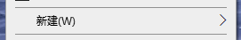
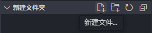
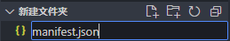
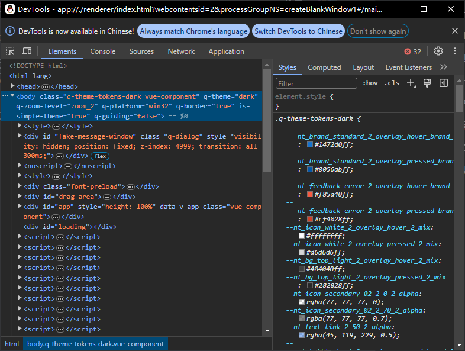
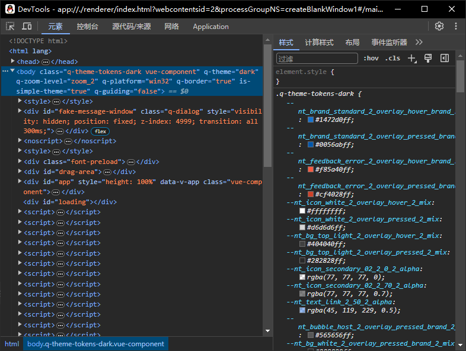

# LiteLoaderQQNT-QuickStart
此指南适用于 LiteLoaderQQNT 插件开发的初学者，只需要了解基本的 JavaScript 语法就可以快速上手 LiteLoaderQQNT 插件开发。（转载请说明出处，作者 854675824@qq.com）

## 什么是 LiteLoaderQQNT?
[**LiteLoaderQQNT**](https://github.com/LiteLoaderQQNT/LiteLoaderQQNT) 是 **NTQQ** 的插件加载器，一般在 **QQNT** 的环境内简称为 **LiteLoader**。**LiteLoaderQQNT** 可以为 **NTQQ** 添加各种功能。

## 安装 LiteLoaderQQNT
### 准备好以下文件后开始安装
* [DLLHijackMethod](https://github.com/LiteLoaderQQNT/QQNTFileVerifyPatch/releases/latest) 用于过掉 QQNT Patch 文件检测。（64 位系统选择 `dbghelp_x64.dll` 下载，32 位系统选择 `dbghelp_x86.dll` 下载）
* [LiteLoaderQQNT](https://github.com/LiteLoaderQQNT/LiteLoaderQQNT/releases/latest) **LiteLoaderQQNT** 本体，直接选择 **`LiteLoaderQQNT.zip`** 下载即可

### 过掉 QQNT Patch 文件检测
右键任务栏中托盘图标中的 **QQ** 并在弹出的菜单中选择 **退出**，将 **`dbghelp_x64.dll` (如果是 32 位系统则为 `dbghelp_x86.dll`)** 文件重命名为 **`dbghelp.dll`**,右键桌面 **QQ** 快捷方式，选择 "**打开文件所在位置(I)**"，复制 **`dbghelp.dll`** 到与 **`QQ.exe`** 文件同级的目录下

### 找到 QQ 的应用目录
右键桌面 **QQ** 快捷方式，选择 "**打开文件所在位置(I)**" 切换到 QQ 的目录，查看当前目录是否存在 **`versions`** 目录。若存在 **`versions`** 目录，则打开 **`versions`** => **`版本号`** => **`resources`** => **`app`** 目录；若不存在 **`versions`** 目录，则打开当前目录的 **`resources`** => **`app`** 目录。这个 **`app`** 目录就是 QQ 的应用目录。

### 解压 LiteLoaderQQNT 本体
将 **`LiteLoaderQQNT.zip`** 解压到任意目录下，推荐存放在系统 **文档** 目录下。（这里以系统 **文档** 目录为例）

### 注入 LiteLoaderQQNT 插件加载器
在 **`app`** 目录下找到 **`app_launcher`** 目录并进入，创建 **`liteloader.js`** 文件，并写入以下代码：（其中 **C:\Users\Cheese\Documents\LiteLoaderQQNT** 为你的 LiteLoaderQQNT 的安装目录）
```js
require(String.raw`C:\Users\Cheese\Documents\LiteLoaderQQNT`)
```

### 修改 QQ 的启动文件
在 **`app`** 目录下找到 **`package.json`** 文件并编辑，找到 **"main":** 那行并修改为以下代码：
```js
"main": "./app_launcher/liteloader.js",
```

### 判断 LiteLoaderQQNT 是否安装成功
双击桌面上的 **QQ** 图标，单击登录按钮，在主界面出现之后，单击左下角的 "**菜单**" 按钮，选择 "**设置**" ，查看设置列表是否出现 "**`LiteLoaderQQNT`**" 选项。若出现则表示安装成功。

## 编写你的第一个 LiteLoaderQQNT 插件
### 环境准备
* [Visual Studio Code](https://code.visualstudio.com/) 开源的轻量级代码编辑器。

### 创建项目
右击桌面空白处，选择 "**新建(W)**"，选择 "**文件夹(F)**"，输入项目名称后回车。
  

### 使用 Visual Studio Code 打开项目
右击项目文件夹，选择 "**通过 Code 打开**"。  


### 创建 manifest.json 配置文件
在项目文件夹中创建一个名为 **`manifest.json`** 的文件，并写入以下代码：
  

```json
{
    // 必选，当前版本为 4
    "manifest_version": 4,
    // 可选，插件类型，可写 extension | theme | framework
    "type": "extension",
    // 必选，插件名字
    "name": "插件模板",
    // 必选，代码内标识
    "slug": "plugin_template",
    // 必选，插件描述
    "description": "LiteLoaderQQNT的插件模板",
    // 必选，版本号
    "version": "0.1.0",
    // 可选，插件的图标，写入相对路径字符串，也可以是 null
    "icon": null,
    // 可选，设置选项的图标，写入相对路径字符串，也可以是 null
    "thumb": null,
    // 必选，作者们的信息
    "authors": [
        {
            "name": "LiteLoaderQQNT",                       // 必选，作者名字
            "link": "https://github.com/LiteLoaderQQNT"     // 必选，作者链接
        }
    ],
    // 可选，插件依赖项，写入插件slug名
    "dependencies": [
        "slug"
    ],
    // 必选，插件支持的系统平台，Windows: win32 | Linux: linux | MacOS: darwin
    "platform": [
        "win32",
        "linux",
        "darwin"
    ],
    // 可选，要注入的脚本
    "injects": {
        "renderer": "./src/renderer.js",    // 可选，渲染进程
        "main": "./src/main.js",            // 可选，主进程
        "preload": "./src/preload.js"       // 可选，预加载脚本
    },
    // 可选，插件仓库信息
    "repository": {
        // 必选，仓库短地址
        "repo": "LiteLoaderQQNT/Plugin-Template",
        // 必选，分支名称
        "branch": "main",
        // 可选，不写将使用仓库源码
        "release": {
            // 必选，tag 名称，不推荐写 latest
            "tag": "0.1.0",
            // 可选，release 内的文件名，不填会直接下载 tag 的源码
            "file": "Plugin-Template.zip"
        }
    }
}
```
### 各参数作用
| 参数 | 作用 |
| --- | --- |
| manifest_version | 插件的版本，目前只支持 4 |
| type | 插件类型，可写 `extension` (插件)、`theme` (主题) 和 `framework` (框架)|
| name | 插件名字 |
| slug | 插件代码内标识 (可以理解为插件的包名) |
| description | 插件描述 |
| version | 版本号 |
| icon | 插件的图标，写入相对路径字符串，也可以是 `null` |
| thumb | 设置选项的图标，写入相对路径字符串，也可以是 `null` |
| authors | 作者们的信息 |
| authors.name | 作者的名字 |
| authors.link | 作者的链接 |
| dependencies | 插件依赖项，写入插件的 slug 名 |
| platform | 插件支持的系统平台，`Windows: win32`、`Linux: linux`、`MacOS: darwin` |
| injects | 要注入的脚本 |
| injects.renderer | 渲染进程 |
| injects.main | 主进程 |
| injects.preload | 预加载脚本 |
| repository | 插件仓库信息 |
| repository.repo | 仓库短地址(例: https://github.com/LiteLoaderQQNT/Plugin-Template => `LiteLoaderQQNT/Plugin-Template`) |
| repository.branch | 分支名称 |
| repository.release | release 内的文件名，不填会直接下载 tag 的源码 |
| repository.release.tag | tag 名称，不推荐写 latest |
| repository.release.file | release 内的文件名，不填会直接下载 tag 的源码 |

### 删除 JSON 中的所有注释（补充）


## LiteLoaderQQNT 加载流程
加载流程如下:
1. QQ NT 启动
2. 加载 LiteLoaderNT 的 init.js
3. 加载 LiteLoaderAPI 接口 (定义 LiteLoader 接口)
4. 加载 Loader Core 的插件加载器 (载入所有插件)
5. 加载 LiteLoaderNT 的 main.js
6. 在 MainLoader 加载时，加载所有插件的 main.js 文件
6. 加载 QQ NT 主界面

安装 **LiteLoaderQQNT** 时修改了 **QQ** 的配置文件 **`package.json`** 的 **main** 字段，当 **QQ** 被加载的时候，实际上加载的是当前目录 **app_launcher** 中的 **`liteloader.js`** 文件，而 **`liteloader.js`** 的内容是 ``require(String raw `C:\Users\Cheese\Documents\LiteLoaderQQNT\`)``，这里需要了解 **require** 函数和 **String.raw** 函数。

### require 函数
require 函数用于加载模块，其参数为模块的绝对路径，这个路径可以为文件或者是文件夹。当加载文件夹时，require 就会读取文件夹下的 **`package.json`** 中的 **main** 字段，然后加载 **main** 字段指向的 JS 文件；若不存在 **main** 字段，或者是根本不存在 **`package.json`** 文件，则默认查找该文件夹下的 **`index.js`** 文件作为模块来载入。）
### String.raw 函数
String.raw 函数用于返回一个字符串，该字符串使用原始的字符串字面量，即不会解析转义字符。
```js
// 创建名为 str 的变量，他的值为 String.raw`\n`，其中 `` 为 模板字符串，\n 为转义字符
let str = String.raw`\n`;
// 输出 str 的值，此时输出的不是换行而是 \n
console.log(str); // \n
// 判断 str 的值是否为 \n，此时输出 true
console.log(str === '\\n'); // true
// 判断 str 的值是否为换行符，此时输出 false
console.log(str === '\n'); // false
```
---
了解了 require 函数和 String.raw 函数，那么 **`liteloader.js`** 的作用就是加载 **`LiteLoaderQQNT`** 文件夹，而 **`LiteLoaderQQNT`** 文件夹下的 **`package.json`** 内容如下：
```json
{
    "name": "liteloader-qqnt",
    "version": "1.2.2",
    "description": "QQNT 插件加载器 LiteLoaderQQNT —— 轻量 · 简洁 · 开源 · 福瑞",
    "main": "./src/init.js",
    "private": true,
    "license": "MIT",
    "author": {
        "name": "LiteLoaderQQNT",
        "url": "https://github.com/LiteLoaderQQNT"
    },
    "homepage": "https://liteloaderqqnt.github.io",
    "bugs": "https://github.com/LiteLoaderQQNT/LiteLoaderQQNT/issues",
    "repository": {
        "type": "git",
        "url": "https://github.com/LiteLoaderQQNT/LiteLoaderQQNT.git"
    }
}
```
可以看到里面的 **`main`** 字段指向了 **`./src/init.js`** 文件，也就是当前 **`package.json`** 所在文件夹中 **`src`** 文件夹里的 **`init.js`** 文件
```js
// 加载 LiteLoaderQQNT 的 API 模块
require("./liteloader_api/main.js");
// 加载插件加载器
require("./loader_core/plugin_loader.js");
// 加载 LiteLoaderQQNT 的入口文件
require("./main.js");
// 调用 path 模块中的 join 方法拼接路径，等效于 require(process.resourcesPath + "/app/app_launcher/index.js")
require(require("path").join(process.resourcesPath, "app/app_launcher/index.js"));

// 延迟 0 ms 后还原 QQ 的 package.json 中的 main 字段指向的文件
setTimeout(() => {
    // 判断当前 QQNT 的构建版本号是否大于等于 28060
    if (LiteLoader.package.qqnt.buildVersion >= 28060) {
        // 设置 QQ 的 main 字段指向的入口文件
        global.launcher.installPathPkgJson.main = "./application/app_launcher/index.js";
    } else {
        // 设置 QQ 的 main 字段指向的入口文件
        global.launcher.installPathPkgJson.main = "./app_launcher/index.js";
    }
}, 0);
```
### LiteLoaderQQNT API
LiteLoaderQQNT 的 API 模块位于 **`./liteloader_api`** 文件夹，该文件夹下有 **`main.js`** 和 **`index.js`** 两个文件， **`main.js`** 文件是 LiteLoaderQQNT 的核心模块， **`index.js`** 文件是 LiteLoaderQQNT 的入口文件， **`main.js`** 文件的内容如下：
```js
// 获取默认的配置文件
// config.json 文件如下
// {
//     "enable_plugins": true, // 是否启用所有插件
//     "disabled_plugins": [], // 禁用的插件列表
//     "deleting_plugins": {}, // 下次启动时要删除的插件列表
//     "installing_plugins": {} // 下次启动时要安装的插件列表
// }
// 获取默认的配置文件
const default_config = require("../settings/static/config.json");
// 从 Node 环境中加载 electron 的 ipcMain 和 shell 模块
// ipcMain: 处理从渲染器进程（网页）发送的异步和同步消息
// shell: 提供了与系统原生应用程序交互的功能，比如打开外部链接、文件等。
const { ipcMain, shell } = require("electron");
// 加载 nodejs 的 path 和 fs 模块
// path: 用于处理文件路径，如拼接路径等
// 例如: path.dirname(path) 获取指定路径所在的文件夹名称
const path = require("node:path");
// fs: 提供了文件系统操作的 API，如读写文件、创建目录等。
// 例如: fs.readFileSync(path) 读取指定路径的文件内容
const fs = require("node:fs");

// 加载 admZip 模块，用于压缩和解压缩文件
const admZip = (() => {
    // .node文件是Node.js中的一个模块，可以包含JavaScript代码、JSON或者编译过的C/C++扩展。
    // 指定 major 模块路径(内部)
    const major_node = path.join(process.resourcesPath, "app/major.node");
    // 指定 launcher 模块路径(外部)
    const launcher_node = path.join(process.resourcesPath, "app/app_launcher/launcher.node");
    // 调用 fs 模块的 existsSync 函数判断 major.node 是否存在
    if (fs.existsSync(major_node)) {
        // 如果存在，则加载 major.node
        require(major_node).load("internal_admzip", module);
    }
    else {
        // 如果不存在，则加载 launcher.node
        require(launcher_node).load("external_admzip", module);
    }
    // 返回加载的 exports.admZip.default 给外部的 admZip
    return exports.admZip.default;
})();

// 获取 LiteLoaderQQNT 的根目录
const root_path = path.join(__dirname, "..", "..");
// 获取 LiteLoaderQQNT 的配置文件
const profile_path = process.env.LITELOADERQQNT_PROFILE ?? root_path;
// 获取 LiteLoaderQQNT 的数据目录
const data_path = path.join(profile_path, "data");
// 获取 LiteLoaderQQNT 的插件目录
const plugins_path = path.join(profile_path, "plugins");
// 获取 LiteLoaderQQNT 的 package.json 文件
const liteloader_package = require(path.join(root_path, "package.json"));
// 获取 QQNT 的 package.json 文件
const qqnt_package = require(path.join(process.resourcesPath, "app/package.json"))
// 获取 QQNT 的版本信息
const qqnt_version = (() => {
    const config_filepath = path.join(process.resourcesPath, "app/versions/config.json");
    return fs.existsSync(config_filepath) ? require(config_filepath) : qqnt_package;
})();


// 通过插件的 slug 名称写入配置文件
// 成功则返回 true，失败则返回 false
function setConfig(slug, new_config) {
    try {
        // 获取插件的 config.json 配置文件路径
        const config_path = path.join(data_path, slug, "config.json");
        // 创建 config.json 的父文件夹
        fs.mkdirSync(path.dirname(config_path), { recursive: true });
        // 以 UTF-8 的编码格式写入 config.json 配置文件
        // JSON.stringify() 方法用于将 JSON 对象转换为 JSON 字符串
        fs.writeFileSync(config_path, JSON.stringify(new_config, null, 4), "utf-8");
        return true;
    } catch {
        return false;
    }
}

// 通过插件的 slug 名称读取配置文件
// 返回读取到的 JSON 对象
function getConfig(slug, default_config) {
    try {
        // 获取插件的 config.json 配置文件路径
        const config_path = path.join(data_path, slug, "config.json");
        // 判断配置文件是否存在
        if (fs.existsSync(config_path)) {
            // 以 UTF-8 的编码格式读取配置文件
            const config = JSON.parse(fs.readFileSync(config_path, "utf-8"));
            // 合并默认配置和读取到的配置
            return Object.assign({}, default_config, config);
        }
        else {
            // 若不存在则以默认配置创建配置文件
            setConfig(slug, default_config);
            return Object.assign({}, default_config, {});
        }
    } catch {
        // 返回默认配置
        return default_config;
    }
}


// 安装插件
// 第一个参数可以为压缩包路径也可以为解压的插件中的 manifest.json 文件
// 若第二个参数为 true 时则撤销安装插件
function pluginInstall(plugin_path, undone = false) {
    try {
        // 判断指定的路径是否为文件(不存在也为 false)
        if (fs.statSync(plugin_path).isFile()) {
            // 判断文件的扩展名是否为 .zip 格式
            if (path.extname(plugin_path).toLowerCase() == ".zip") {
                // 创建 admZip 对象
                const plugin_zip = new admZip(plugin_path);
                // 遍历压缩包中的所有条目
                for (const entry of plugin_zip.getEntries()) {
                    // 判断文件名是否为 manifest.json 且不是文件夹
                    if (entry.entryName == "manifest.json" && !entry.isDirectory) {
                        // 读取 manifest.json 的 slug 名称
                        // entry.getData() 用于读取条目的数据
                        // JSON.parse() 方法用于将 JSON 字符串转换为 JSON 对象
                        // const { slug } = 可以直接获取 JSON 对象中的属性
                        const { slug } = JSON.parse(entry.getData());
                        // 判断插件是否已安装,若已安装则删除
                        if (slug in LiteLoader.plugins) LiteLoader.api.plugin.delete(slug, false, false);
                        // 获取 LiteLoader 的配置
                        const config = LiteLoader.api.config.get("LiteLoader", default_config);
                        // 如果 undone 为 true 则撤销安装
                        if (undone) delete config.installing_plugins[slug];
                        // 否则添加到正在安装的插件列表
                        else config.installing_plugins[slug] = {
                            // 插件文件路径
                            plugin_path: plugin_path,
                            // 插件文件类型
                            plugin_type: "zip"
                        };
                        // 更新 LiteLoader 的配置
                        LiteLoader.api.config.set("LiteLoader", config);
                        return true;
                    }
                }
            }
            // 通过 manifest.json 文件安装插件
            if (path.basename(plugin_path) == "manifest.json") {
                // 获取插件的 slug 名称
                const { slug } = JSON.parse(fs.readFileSync(plugin_path));
                // 判断插件是否已安装,若已安装则删除
                if (slug in LiteLoader.plugins) LiteLoader.api.plugin.delete(slug, false, false);
                // 获取 LiteLoader 的配置
                const config = LiteLoader.api.config.get("LiteLoader", default_config);
                // 如果 undone 为 true 则撤销安装
                if (undone) delete config.installing_plugins[slug];
                // 否则添加到正在安装的插件列表
                else config.installing_plugins[slug] = {
                    // 插件文件路径
                    plugin_path: plugin_path,
                    // 插件文件类型
                    plugin_type: "json"
                };
                // 更新 LiteLoader 的配置
                LiteLoader.api.config.set("LiteLoader", config);
                return true;
            }
        }
    } catch (error) {
        // 从调试台输出错误信息
        console.error(error);
    }
    return false;
}

// 根据 slug 删除插件
// 第一个参数为插件的 slug
// 第二个参数为是否删除插件的数据文件夹
// 第三个参数为是否撤销删除
function pluginDelete(slug, delete_data = false, undone = false) {
    // 判断插件是否存在，若不存在则直接返回 true 结束函数
    if (!(slug in LiteLoader.plugins)) return true;
    // 获取插件文件夹和数据文件夹路径
    // LiteLoader.plugins[slug].path 为一个 JSON 对象
    const { plugin, data } = LiteLoader.plugins[slug].path;
    // 获取 LiteLoader 的配置
    const config = LiteLoader.api.config.get("LiteLoader", default_config);
    // 如果 undone 为 true 则撤销删除
    if (undone) delete config.deleting_plugins[slug];
    // 否则添加到将删除的插件列表
    else config.deleting_plugins[slug] = {
        // 插件文件路径
        plugin_path: plugin,
        // 插件数据文件夹路径
        data_path: delete_data ? data : null
    };
    // 更新 LiteLoader 的配置
    LiteLoader.api.config.set("LiteLoader", config);
}

// 启用/禁用插件
// 第一个参数为插件的 slug 名称
// 第二个参数为是否撤销禁用 
function pluginDisable(slug, undone = false) {
    // 获取 LiteLoader 的配置
    const config = LiteLoader.api.config.get("LiteLoader", default_config);
    // 如果 undone 为 true 则撤销禁用
    if (undone) config.disabled_plugins = config.disabled_plugins.filter(item => item != slug);
    // 否则添加到禁用的插件列表
    else config.disabled_plugins = config.disabled_plugins.concat(slug);
    // 更新 LiteLoader 的配置
    LiteLoader.api.config.set("LiteLoader", config);
}

// 定义 LiteLoader API
const LiteLoader = {
    path: {
        // LiteLoader 的根目录
        root: root_path,
        // LiteLoader 的配置文件路径
        profile: profile_path,
        // LiteLoader 的数据文件夹路径
        data: data_path,
        // LiteLoader 的插件文件夹路径
        plugins: plugins_path
    },
    versions: {
        // QQNT 的版本信息
        qqnt: qqnt_version.curVersion ?? qqnt_version.version,
        // LiteLoader 的版本信息
        liteloader: liteloader_package.version,
        // Node.js 的版本信息
        node: process.versions.node,
        // Chromium 的版本信息
        chrome: process.versions.chrome,
        // Electron 的版本信息
        electron: process.versions.electron
    },
    os: {
        // 操作系统平台
        platform: process.platform
    },
    package: {
        // LiteLoader 的包信息
        liteloader: liteloader_package,
        // QQNT 的包信息
        qqnt: qqnt_package
    },
    // 插件列表
    plugins: {},
    api: {
        config: {
            // 设置配置
            set: setConfig,
            // 获取配置
            get: getConfig
        },
        plugin: {
            // 安装插件
            install: pluginInstall,
            // 删除插件
            delete: pluginDelete,
            // 启用/禁用插件
            disable: pluginDisable
        },
        // 打开外部链接
        openExternal: shell.openExternal,
        // 打开文件路径
        openPath: shell.openPath
    }
};


// 将 LiteLoader 对象挂载到全局
const whitelist = [
    // LiteLoader 的根目录
    LiteLoader.path.root,
    // LiteLoader 的配置文件路径
    LiteLoader.path.profile,
    // LiteLoader 的数据文件夹路径
    LiteLoader.path.data,
    // LiteLoader 的插件文件夹路径
    LiteLoader.path.plugins,
];
try {
    whitelist.push(fs.realpathSync(LiteLoader.path.root));
    whitelist.push(fs.realpathSync(LiteLoader.path.profile));
    whitelist.push(fs.realpathSync(LiteLoader.path.plugins));
    whitelist.push(fs.realpathSync(LiteLoader.path.data));
} catch { };
// 将 LiteLoader 对象挂载到全局
Object.defineProperty(globalThis, "LiteLoader", {
    // 不可修改
    configurable: false,
    // 不可枚举
    get() {
        const stack = new Error().stack.split("\n")[2];
        if (whitelist.some(item => stack.includes(item))) {
            return LiteLoader;
        }
    }
});


// 将 LiteLoader 对象挂载到 window
ipcMain.on("LiteLoader.LiteLoader.LiteLoader", (event) => {
    // 阻止事件继续传播
    event.returnValue = {
        ...LiteLoader,
        api: void null
    }
});

// 监听 LiteLoader.api
ipcMain.handle("LiteLoader.LiteLoader.api", (event, name, method, args) => {
    try {
        if (name == method) return LiteLoader.api[method](...args);
        else return LiteLoader.api[name][method](...args);
    } catch (error) {
        return null;
    }
});

```

### Loader Core
**`Loader Core`** 是一个核心模块，负责加载插件、启用插件、禁用插件等核心功能。
位于 **`./loader_core/`** 文件夹中，在 LiteLoader 的加载流程中，他是在 LiteLoader API 之后被加载的，加载的文件为 **`loader_core.js`**。
```js
// 引入 Electron 的 app 和 dialog 模块
// app 模块用于获取 Electron 的基本信息
// 例如: app.quit() 退出 Electron
// dialog 模块用于弹出对话框
// 例如: dialog.showOpenDialog({ properties: ['openFile', 'multiSelections'] }) 弹出对话框
const { app, dialog } = require("electron");
// 加载 nodejs 的 path 和 fs 模块
// path: 用于处理文件路径，如拼接路径等
// 例如: path.dirname(path) 获取指定路径所在的文件夹名称
const path = require("node:path");
// fs: 提供了文件系统操作的 API，如读写文件、创建目录等。
// 例如: fs.readFileSync(path) 读取指定路径的文件内容
const fs = require("node:fs");
// config.json 文件如下
// {
//     "enable_plugins": true, // 是否启用所有插件
//     "disabled_plugins": [], // 禁用的插件列表
//     "deleting_plugins": {}, // 下次启动时要删除的插件列表
//     "installing_plugins": {} // 下次启动时要安装的插件列表
// }
// 获取默认的配置文件
const default_config = require("../settings/static/config.json");

// 加载 admZip 模块，用于压缩和解压缩文件
const admZip = (() => {
    // .node文件是Node.js中的一个模块，可以包含JavaScript代码、JSON或者编译过的C/C++扩展。
    // 指定 major 模块路径(内部)
    const major_node = path.join(process.resourcesPath, "app/major.node");
    // 指定 launcher 模块路径(外部)
    const launcher_node = path.join(process.resourcesPath, "app/app_launcher/launcher.node");
    // 调用 fs 模块的 existsSync 函数判断 major.node 是否存在
    if (fs.existsSync(major_node)) {
        // 如果存在，则加载 major.node
        require(major_node).load("internal_admzip", module);
    }
    else {
        // 如果不存在，则加载 launcher.node
        require(launcher_node).load("external_admzip", module);
    }
    // 返回加载的 exports.admZip.default 给外部的 admZip
    return exports.admZip.default;
})();

// 定义 output 函数，用于输出日志，会在前面加上绿色的 [LiteLoader] 字样
const output = (...args) => console.log("\x1b[32m%s\x1b[0m", "[LiteLoader]", ...args);
// 获取 LiteLoader 的默认配置
const config = LiteLoader.api.config.get("LiteLoader", default_config);


// 通过 slug 删除插件
function deletePlugin(slug) {
    try {
        // 获取插件的删除路径和数据路径
        const { plugin_path, data_path } = config.deleting_plugins[slug];
        // 递归删除插件的数据文件，recursive: true 表示启用递归删除
        if (data_path) fs.rmSync(data_path, { recursive: true });
        // 递归删除插件的根目录，recursive: true 表示启用递归删除
        fs.rmSync(plugin_path, { recursive: true });
    }
    catch (error) {
        // 输出错误信息
        output("Deleting Plugin Error", error);
        // 在程序准备创建窗口时弹出错误对话框
        app.on("ready", () => {
            // 弹出错误对话框
            dialog.showMessageBox(null, {
                // 设置对话框的类型
                type: "error",
                // 设置对话框的标题
                title: "LiteLoaderQQNT",
                // 设置对话框的内容
                message: `删除插件时报错，请检查并手动删除\n${error}`
            });
        });
    }
    finally {
        // 最后删除 slug
        delete config.deleting_plugins[slug];
        // 更新 LiteLoader 的配置
        LiteLoader.api.config.set("LiteLoader", config);
    }
}


// 通过 slug 安装插件
function InstallPlugin(slug) {
    try {
        // 获取插件的文件路径和文化部类型
        const { plugin_path, plugin_type } = config.installing_plugins[slug];
        // 获取插件在 LiteLoader 存储的文件夹
        const dest_path = path.join(LiteLoader.path.plugins, slug);
        // 判断插件是否已存在，如果存在，则重命名
        if (fs.existsSync(dest_path)) {
            fs.renameSync(dest_path, `${dest_path}_${parseInt(Math.random() * 100000)} `);
        }
        // 判断插件文件是否为 ZIP 文件
        if (plugin_type == "zip") {
            // 解压　ZIP 文件到插件文件夹
            new admZip(plugin_path).extractAllTo(dest_path);
        }
        // 判断插件文件是否为 JSON 文件
        if (plugin_type == "json") {
            // 复制插件所在的文件夹到插件文件夹
            fs.cpSync(path.dirname(plugin_path), dest_path, { recursive: true });
        }
    }
    catch (error) {
        // 输出错误信息
        output("Installing Plugin Error", error);
        // 在程序准备创建窗口时弹出错误对话框
        app.on("ready", () => {
            // 弹出错误对话框
            dialog.showMessageBox(null, {
                // 设置对话框的类型
                type: "error",
                // 设置对话框的标题
                title: "LiteLoaderQQNT",
                // 设置对话框的内容
                message: `安装插件时报错，请检查并手动安装\n${error}`
            });
        });
    }
    finally {
        // 最后删除 slug
        delete config.installing_plugins[slug];
        // 更新 LiteLoader 的配置
        LiteLoader.api.config.set("LiteLoader", config);
    }
}

// 查找所有插件
function findAllPlugin() {
    // 定义 plugins 为插件列表
    const plugins = [];
    try {
        // 创建 LiteLoader 的插件文件夹
        fs.mkdirSync(LiteLoader.path.plugins, { recursive: true });
        // 遍历插件文件夹
        for (const pathname of fs.readdirSync(LiteLoader.path.plugins, "utf-8")) {
            try {
                // 获取插件的 manifest.json 文件
                const filepath = path.join(LiteLoader.path.plugins, pathname, "manifest.json");
                // 读取 manifest.json 文件
                const manifest = JSON.parse(fs.readFileSync(filepath, "utf-8"));
                // 判断 manifest_version 插件版本是否为 4 则插入到 plugins 列表
                if (manifest.manifest_version == 4) plugins.push({ pathname, manifest });
            }
            catch { continue }
        }
    }
    catch (error) {
        // 输出错误信息
        output("Find Plugin Error", error);
        // 在程序准备创建窗口时弹出错误对话框
        app.on("ready", () => {
            // 弹出错误对话框
            dialog.showMessageBox(null, {
                // 设置对话框的类型
                type: "warning",
                // 设置对话框的标题
                title: "LiteLoaderQQNT",
                // 设置对话框的内容
                message: `在读取数据目录时报错了！请检查插件目录或忽略继续启动\n${error}`
            });
        });
    }
    // 返回插件列表
    return plugins;
}

// 获取插件信息
// 第一个参数为插件的名称
// 第二个参数为 manifest 配置
function getPluginInfo(pathname, manifest) {
    // 判断插件是否与当前平台不兼容
    const incompatible_platform = !manifest.platform.includes(LiteLoader.os.platform);
    // 判断插件是否被禁用
    const disabled_plugin = config.disabled_plugins.includes(manifest.slug);
    // 获取插件的绝对路径
    const plugin_path = path.join(LiteLoader.path.plugins, pathname);
    // 获取插件的数据路径
    const data_path = path.join(LiteLoader.path.data, manifest.slug);
    // 获取插件的 main.js 文件
    const main_file = path.join(plugin_path, manifest?.injects?.main ?? "");
    // 获取插件的 preload.js 文件
    const preload_file = path.join(plugin_path, manifest?.injects?.preload ?? "");
    // 获取插件的 renderer.js 文件
    const renderer_file = path.join(plugin_path, manifest?.injects?.renderer ?? "");
    return {
        manifest: manifest,
        incompatible: incompatible_platform,
        disabled: disabled_plugin,
        path: {
            plugin: plugin_path,
            data: data_path,
            injects: {
                main: fs.statSync(main_file).isFile() ? main_file : null,
                preload: fs.statSync(preload_file).isFile() ? preload_file : null,
                renderer: fs.statSync(renderer_file).isFile() ? renderer_file : null
            }
        }
    }
}

// 加载所有插件
function loadAllPlugin() {
    // 查找所有插件
    const plugins = findAllPlugin();
    // 创建依赖列表
    const dependencies = new Set();
    // 遍历插件的文件名和 manifest 配置
    for (const { pathname, manifest } of plugins) {
        // 输出插件信息
        output("Found Plugin:", manifest.name);
        // 获取插件信息
        LiteLoader.plugins[manifest.slug] = getPluginInfo(pathname, manifest);
        // 将插件的依赖项加到依赖列表中
        manifest.dependencies?.forEach?.(slug => dependencies.add(slug));
    }
    // 获取插件的 slug 列表
    const slugs = plugins.map(plugin => plugin.manifest.slug);
    // 获取插件的依赖项中没有的依赖项
    const missing = [...dependencies].filter(slug => !slugs.includes(slug));
    // 遍历缺少的依赖项
    for (const slug of missing) {
        // 输出缺少的依赖项
        output("Missing Plugin:", slug);
        // 在程序准备创建窗口时弹出错误对话框
        app.on("ready", () => {
            // 弹出错误对话框
            dialog.showMessageBox(null, {
                // 设置对话框的类型
                type: "warning",
                // 设置对话框的标题
                title: "LiteLoaderQQNT",
                // 设置对话框的内容
                message: `插件缺少依赖：${slug}`
            });
        });
    }
}


// 删除上次要删除的插件
for (const slug in config.deleting_plugins) {
    // 调用 deletePlugin 函数删除插件
    deletePlugin(slug);
}

// 安装上次要安装的插件
for (const slug in config.installing_plugins) {
    // 调用 InstallPlugin 函数安装插件
    InstallPlugin(slug);
}

// 加载插件
if (config.enable_plugins) {
    // 加载所有插件
    loadAllPlugin();
}
```

### LiteLoader 主要文件 main.js
继 LiteLoaderAPI 接口，LoaderCore 载入所有插件之后，LiteLoader 的主要文件 main.js 开始被加载：
```js
// 获取 LoaderCore 的 MainLoader 类
const { MainLoader } = require("./loader_core/main.js");
// 获取协议方案
const { protocolRegister } = require("./protocol_scheme/main.js");
// 加载 Node 的 path 模块
const path = require("path");

// 初始化 loader 加载器
const loader = new MainLoader().init();

// 代理的浏览器窗口对象
function proxyBrowserWindowConstruct(target, argArray, newTarget) {
    // 创建被代理的浏览器窗口对象
    const window = Reflect.construct(target, argArray, newTarget);

    // 监听浏览器窗口 send 函数事件
    window.webContents.send = new Proxy(window.webContents.send, {
        apply(target, thisArg, [channel, ...args]) {
            if (channel.includes("IPC_DOWN_")) {
                // 判断账号是否登录成功
                if (args?.[1]?.[0]?.cmdName == "nodeIKernelSessionListener/onSessionInitComplete") {
                    // 获取登陆的 uid
                    const uid = args[1][0].payload.uid;
                    // 传入到 loader 的 onLogin 函数
                    loader.onLogin(uid);
                }
            }
            return Reflect.apply(target, thisArg, [channel, ...args]);
        }
    });

    // 注入预加载文件
    window.webContents._getPreloadPaths = new Proxy(window.webContents._getPreloadPaths, {
        apply(target, thisArg, argArray) {
            return [
                ...Reflect.apply(target, thisArg, argArray),
                path.join(LiteLoader.path.root, "src/preload.js")
            ];
        }
    });

    // 加载自定义协议
    protocolRegister(window.webContents.session.protocol);

    // 加载插件
    // 给 loader 加载器 onBrowserWindowCreated 函数传入 window 对象
    loader.onBrowserWindowCreated(window);

    return window;
}


// 监听窗口创建并加载代理
require.cache["electron"] = new Proxy(require.cache["electron"], {
    get(target, property, receiver) {
        const electron = Reflect.get(target, property, receiver);
        return property != "exports" ? electron : new Proxy(electron, {
            get(target, property, receiver) {
                // 通过拦截的方式，代理创建的窗口
                const BrowserWindow = Reflect.get(target, property, receiver);
                return property != "BrowserWindow" ? BrowserWindow : new Proxy(BrowserWindow, {
                    construct: proxyBrowserWindowConstruct
                });
            }
        });
    }
});
```

### Loader Core MainLoader
LoaderCore 的 MainLoader 类用于初始化和管理插件：
```js
// 拓扑排序函数
// 第一个参数为依赖项列表
// 会按照依赖关系进行排序
function topologicalSort(dependencies) {
    // 创建排序后的插件列表
    const sorted = [];
    // 创建已访问的插件列表
    const visited = new Set();
    const visit = (slug) => {
        // 如果插件已经访问过，则跳过
        if (visited.has(slug)) return;
        // 将插件添加到已访问的插件列表
        visited.add(slug);
        // 获取插件信息
        const plugin = LiteLoader.plugins[slug];
        // 遍历插件的依赖项添加到已访问的插件列表
        plugin.manifest.dependencies?.forEach(depSlug => visit(depSlug));
        // 将插件添加到排序后的插件列表
        sorted.push(slug);
    }
    dependencies.forEach(slug => visit(slug));
    return sorted;
}

// 创建全局的 MainLoader 类
exports.MainLoader = class {

    #exports = {};

    init() {
        // 加载所有依赖插件
        for (const slug of topologicalSort(Object.keys(LiteLoader.plugins))) {
            // 通过 slug 获取插件信息
            const plugin = LiteLoader.plugins[slug];
            // 跳过禁用和不适用当前平台的插件
            if (plugin.disabled || plugin.incompatible) {
                continue;
            }
            // 加载插件的 main.js 文件
            if (plugin.path.injects.main) {
                try {
                    // 加载插件的 main.js 文件
                    this.#exports[slug] = require(plugin.path.injects.main);
                }
                catch (e) {
                    // 如果加载失败则保存错误到插件信息中
                    plugin.error = { message: `[Main] ${e.message}`, stack: e.stack };
                }
            }
        }
        return this;
    }

    // 当浏览器窗口创建时调用
    onBrowserWindowCreated(window) {
        // 遍历所有插件
        for (const slug in this.#exports) {
            // 获取插件信息
            const plugin = this.#exports[slug];
            // 调用插件的 onBrowserWindowCreated 函数
            plugin.onBrowserWindowCreated?.(window);
        }
    }

    // 当账号登录时调用
    onLogin(uid) {
        // 遍历所有插件
        for (const slug in this.#exports) {
            // 获取插件信息
            const plugin = this.#exports[slug];
            // 调用插件的 onLogin 函数
            plugin.onLogin?.(uid);
        }
    }

}
```
### LiteLoaderNTQQ Protocol Scheme 自定义协议
LiteLoaderNTQQ 自定义了一种 local:// 协议，以下是协议的例子  
```js
// 访问本地的文件
// 等效于 C:/test.txt
const url1 = new URL("local:///C:/test.txt");
// 在 local 协议中，root 等效于 LiteLoader.path.root
// 等效于 LiteLoaderQQNT文件夹根目录/package.json
const url2 = new URL("local:///root/package.json");
// 在 local 协议中，profile 等效于 LiteLoader.path.profile
// 等效于 LiteLoaderQQNT文件夹根目录/package.json
// 或者等效于其他的配置文件目录
const url3 = new URL("local:///profile/package.json");
```

```js
// 加载 Electron 里的 app、protocol 和 net 模块
const { app, protocol, net } = require("electron");
// 加载 Node 的 path 模块
const path = require("path");

// 在程序准备创建窗口时添加自定义协议
app.on("ready", () => {
    // 定义 local 协议
    const schemes = ["local"];
    // 获取原有的协议列表
    const old_schemes = app.commandLine.getSwitchValue("fetch-schemes");
    // 合并协议列表
    const new_schemes = [old_schemes, ...schemes].join(",");
    // 更改 fetch-schemes 参数
    app.commandLine.appendSwitch("fetch-schemes", new_schemes);
});

// 注册自定义协议
protocol.registerSchemesAsPrivileged([
    {
        // 自定义协议名称
        scheme: "local",
        // 是否支持标准协议
        privileges: {
            // 不支持标准协议
            standard: false,
            // 支持跨域
            allowServiceWorkers: true,
            // 不支持跨源请求
            corsEnabled: false,
            // 支持 Fetch API
            supportFetchAPI: true,
            // 支持流
            stream: true,
            // 绕过 CSP 内容安全策略
            bypassCSP: true
        }
    }
]);


// 注册全局协议
exports.protocolRegister = (protocol) => {
    // 检查协议是否已经注册
    if (!protocol.isProtocolRegistered("local")) {
        // 注册协议
        protocol.handle("local", (req) => {
            // 解析请求的 URL
            const { host, pathname } = new URL(decodeURI(req.url));
            // 获取文件路径
            const filepath = path.normalize(pathname.slice(1));
            // 根据不同的主机名返回不同的文件路径
            switch (host) {
                // 根目录
                case "root": return net.fetch(`file:///${LiteLoader.path.root}/${filepath}`);
                // 配置目录
                case "profile": return net.fetch(`file:///${LiteLoader.path.profile}/${filepath}`);
                // 插件目录
                default: return net.fetch(`file://${host}/${filepath}`);
            }
        });
    }
}
```
### Preload JavaScript 预加载脚本
LiteLoaderQQNT 通过给 **`window.webContents._getPreloadPaths`** 添加代理的方法注入 **`./preload.js`** 脚本：
```js
// 监听 HTML 文档加载完成事件
document.addEventListener("DOMContentLoaded", () => {
    // 创建 script 标签
    const script = document.createElement("script");
    // 设置 script 标签的属性
    script.type = "module";
    // 加载 renderer.js
    script.src = `local://root/src/renderer.js`;
    document.head.prepend(script);
});


// 运行外部脚本
Object.defineProperty(globalThis, "runPreloadScript", {
    configurable: false,
    value: content => new Function(
        "require",
        "process",
        "Buffer",
        "global",
        "setImmediate",
        "clearImmediate",
        "exports",
        "module",
        content
    )(...arguments)
});


// 加载插件 Preload
(async () => {
    // 运行 ./liteloader_api/preload.js
    runPreloadScript(await (await fetch(`local://root/src/liteloader_api/preload.js`)).text());
    // 运行 ./loader_core/preload.js
    runPreloadScript(await (await fetch(`local://root/src/loader_core/preload.js`)).text());
})();
```

### 渲染进程脚本 renderer.js
Tips: 关于渲染解析就写到这里
```js
// 加载 LiteLoaderQQNT 的组件
import "./components/renderer.js";
// 加载 LiteLoaderQQNT 的彩蛋
import "./easter_eggs/renderer.js";
...
```

## 使用插件进行快速开发
### 准备好以下文件后开始安装
* [Chii-devtools](https://github.com/mo-jinran/chii-devtools/releases/latest) 适用于 QQ NT 的 F12 开发者工具  
* ~~[Just F5](https://github.com/xinyihl/LiteLoaderQQNT-JustF5/releases/latest) 适用于 QQ NT 的页面刷新插件~~ 

1. 双击桌面上的 **QQ** 图标，单击登录按钮
2. 在主界面出现之后，单击左下角的 **`菜单`** 按钮，选择 **`设置`** 
3. 在设置列表中选择 **`LiteLoaderQQNT`** 选项。
4. 在 插件 栏中选择 **`安装新插件`** 右侧的 **`选择文件`** 按钮
5. 选择刚刚下载的 **`chii-devtools.zip`** 文件，并点击 **`打开`**
6. 重新启动 **QQ**，按 F12 查看是否有调试窗口出现  

7. 单击提示消息中的 **Switch DevTools to Chinese**，设置语言为中文
8. 关闭 DevTools 窗口，再次按下 F12 查看语言设置是否生效  
